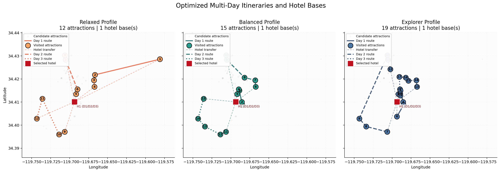
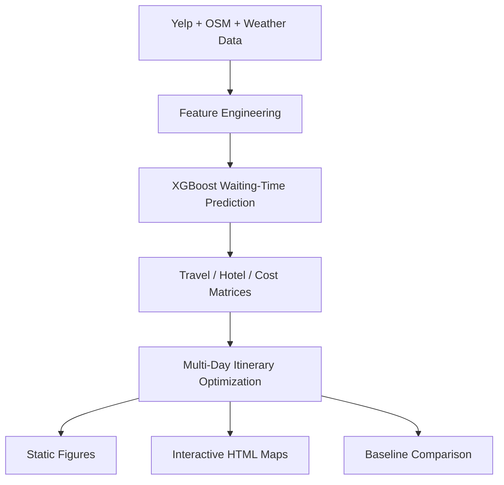

<div align="center">

# Weather-Aware Travel Itinerary Optimization

**A hybrid machine learning + operations research pipeline for multi-day travel planning under weather, travel-time, congestion, hotel, and budget constraints.**

<p>
  
  
  
  
</p>

<p>
  
  
  
  
</p>

<p>
  
  
  
  
</p>

<p>
  
  
  
</p>

</div>

This project was developed for **IE5533 – Operations Research for Data Science**.

The current notebook implements a **multi-day Tourist Trip Design Problem (TTDP)** with **overnight hotel choice**, **weather-aware waiting-time prediction**, **budget control**, and **content-diversity penalties**. Rather than selecting attractions independently, the model jointly decides:

- which attractions to visit,
- on which day to visit them,
- in what order to route them,
- which hotel to use each day,
- whether to stay or relocate overnight,
- and how aggressively to explore based on traveler profile.

---

## Interactive Results

- [Interactive route map (CP-SAT)](results/figures/tourist_routes_map.html)
- [Interactive route map (Gurobi)](results/figures/tourist_routes_map_gurobi.html)
- [Static route overview (Gurobi PNG)](results/figures/tourist_routes_static_gurobi.png)

> GitHub may not render the HTML maps inline. If the preview is blocked, download the HTML file or open the project locally and run `python -m http.server`, then visit the generated local URL.



---

## Project Overview

Urban tourists typically face a constrained planning problem: they have limited time, limited budget, uncertain congestion, and many potentially attractive destinations. A realistic itinerary system therefore needs to do more than rank attractions by popularity.

This project proposes a **three-layer decision framework**:

1. **Attraction utility modeling** using review and rating signals.
2. **Weather-aware congestion estimation** using historical and real-time context.
3. **Multi-day route optimization** with attraction choice, hotel choice, and sequencing.

The resulting system combines **predictive modeling** with **discrete optimization** to produce itineraries that are both **data-driven** and **operationally feasible**.

---

## Mathematical Formulation

The current notebook formulation is a **multi-day mixed-integer optimization model** with attraction, routing, and overnight accommodation decisions. On the attraction side, it follows the logic of TTDP-style utility, travel, and time tradeoffs. On the accommodation side, it follows the idea of OPHS-style hotel selection and hotel-sequence decisions.

### Sets and Indices

- $i, j \in A$: candidate attractions
- $h, g \in H$: candidate hotels / accommodations
- $d \in D = \{1, \dots, K\}$: day index
- $c \in C$: inferred content themes such as `beach`, `park`, `museum`, `tour`
- $E \subseteq A \times A$: feasible attraction-to-attraction arcs, filtered by a maximum travel threshold

### Preprocessing and Feature Normalization

The notebook first validates that all prerequisite data are available:

- enriched attraction table `top100_with_waiting_time`
- attraction travel-time matrix
- hotel table `hotels_df`
- hotel-to-attraction travel times
- hotel-to-hotel relocation times

Attraction and hotel features are then normalized:

$$
\tilde{u}_i = \text{MinMax}(u_i), \quad
\tilde{w}_i = \text{MinMax}(w_i), \quad
\tilde{c}_i = \text{MinMax}(c_i)
$$

and

$$
\tilde{p}_h = \text{MinMax}(p_h), \quad
\tilde{r}_h = \text{MinMax}(r_h), \quad
\tilde{e}_h = \text{MinMax}(e_h)
$$

where:

- $u_i$ is attraction utility,
- $w_i$ is the final weather-aware waiting-time estimate,
- $s_i$ is the simulated visit duration,
- $c_i$ is attraction cost,
- $p_h$ is hotel nightly price,
- $r_h$ is hotel rating,
- $e_h$ is hotel experience score.

The accommodation score used in the objective is:

$$
v_h = 0.45\tilde{r}_h + 0.35\tilde{e}_h - 0.20\tilde{p}_h
$$

The overnight relocation matrix is also normalized:

$$
\tilde{\tau}_{hg} = \text{MinMax}(\tau_{hg})
$$

To model diminishing marginal dislike of expensive attractions, the notebook uses a concave cost penalty:

$$
P(c_i) = \tilde{c}_i^{\,p}, \qquad 0 < p < 1
$$

with $p = 0.7$ in the current implementation.

### Tourist Profiles

The model supports three traveler profiles:

- **Relaxed**: strong waiting-time aversion, fewer attractions, lighter exploration bonus
- **Balanced**: moderate tradeoff between utility and travel
- **Explorer**: weaker waiting-time aversion, higher attraction targets, stronger exploration bonus

Each profile defines:

- waiting-time weight $\alpha_p$,
- travel-time weight $\beta_p$,
- minimum and target number of attractions,
- maximum attractions per day,
- minimum attractions per used day,
- attraction bonus $\lambda_p$,
- maximum average waiting tolerance.

### Decision Variables

For each attraction $i$, hotel $h$, and day $d$, the model uses:

$$
x_{id} =
\begin{cases}
1 & \text{if attraction } i \text{ is visited on day } d \\
0 & \text{otherwise}
\end{cases}
$$

$$
y_{ijd} =
\begin{cases}
1 & \text{if travel occurs from attraction } i \text{ to } j \text{ on day } d \\
0 & \text{otherwise}
\end{cases}
$$

$$
z_{hd} =
\begin{cases}
1 & \text{if hotel } h \text{ is selected on day } d \\
0 & \text{otherwise}
\end{cases}
$$

$$
s_{hid} =
\begin{cases}
1 & \text{if day } d \text{ starts at hotel } h \text{ and first visits attraction } i \\
0 & \text{otherwise}
\end{cases}
$$

$$
e_{ihd} =
\begin{cases}
1 & \text{if day } d \text{ ends at attraction } i \text{ and returns to hotel } h \\
0 & \text{otherwise}
\end{cases}
$$

$$
q_{hgd} =
\begin{cases}
1 & \text{if the itinerary transitions from hotel } h \text{ on day } d \text{ to hotel } g \text{ on day } d+1 \\
0 & \text{otherwise}
\end{cases}
$$

$$
a_d =
\begin{cases}
1 & \text{if sightseeing is active on day } d \\
0 & \text{otherwise}
\end{cases}
$$

The MTZ ordering variables $u_{id}$ are introduced to eliminate subtours within each day.

In addition, the model defines:

- content-repeat slack variables for each theme,
- heavy-repeat slack variables for each theme,
- an attraction shortfall variable relative to the profile target.

### Objective Function

For a given tourist profile $p$, the objective maximizes the overall itinerary utility by balancing attraction enjoyment with penalties for waiting time, travel time, monetary cost, hotel relocation, and excessive thematic repetition.

The optimization objective is:

$$
\begin{aligned}
\max \quad
& \sum_{d \in D}\sum_{i \in A}
\Big(
\tilde{u}_i
- \alpha_p \tilde{w}_i
- \gamma P(c_i)
+ \lambda_p
\Big)x_{id} \\
&\quad
- \sum_{d \in D}\sum_{(i,j) \in E}
\beta_p \tilde{t}_{ij} y_{ijd}
+ \omega \sum_{d \in D}\sum_{h \in H} v_h z_{hd} \\
&\quad
- \mu \sum_{d=1}^{K-1}\sum_{h \in H}\sum_{g \in H}\tilde{\tau}_{hg} q_{hgd}
- \phi \sum_{d=1}^{K-1}\sum_{h \neq g} q_{hgd} \\
&\quad
- \rho_1 \sum_{c \in C} R_c
- \rho_2 \sum_{c \in C} H_c
- \rho_3 \Delta_p
\end{aligned}

$$

This objective matches the notebook logic:

- reward attraction utility and a profile-dependent exploration bonus,
- penalize waiting time, travel time, and attraction cost,
- reward higher-value accommodations,
- penalize overnight relocation time and hotel switching,
- penalize excessive thematic repetition,
- penalize falling short of the profile target number of attractions.

#### Parameter Interpretation

- $\alpha_p$: profile-dependent waiting-time penalty
- $\beta_p$: profile-dependent travel-time penalty
- $\gamma$: attraction-cost penalty weight
- $\lambda_p$: profile-dependent attraction bonus
- $\omega$: weight assigned to hotel quality
- $\mu$: penalty for overnight relocation time
- $\phi$: fixed penalty for switching hotels between days
- $R_c, H_c$: soft repetition penalties for content theme $c$
- $\Delta_p$: shortfall from the target number of attractions for profile $p$

#### Implementation Note

Since the solver used is **CP-SAT**, which operates over integer variables and coefficients, all objective coefficients are scaled by a constant factor during implementation. This preserves the relative weighting of objective components while ensuring the model remains compatible with the integer constraint requirements of the CP-SAT framework.

### Constraints

The model is subject to the following main constraint families.

#### 1. Daily time budget

For each day $d$:

$$
\sum_{i \in A}(s_i + w_i)x_{id}
+ \sum_{(i,j) \in E} t_{ij} y_{ijd}
+ \sum_{h \in H}\sum_{i \in A} t^{H \to A}_{hi}s_{hid}
+ \sum_{i \in A}\sum_{h \in H} t^{A \to H}_{ih}e_{ihd}
\le T
$$

This enforces that each day respects the sightseeing time budget, including visit duration, waiting time, travel between attractions, hotel departure, and hotel return.

#### 2. Total trip budget

$$
\sum_{d \in D}\sum_{i \in A} c_i x_{id}
+ \sum_{d \in D}\sum_{h \in H} p_h z_{hd}
\le B
$$

This jointly controls attraction spending and accommodation spending.

#### 3. Hotel assignment and overnight transition consistency

Each day selects exactly one hotel:

$$
\sum_{h \in H} z_{hd} = 1 \qquad \forall d
$$

And the overnight transition variables must match the hotel chosen on consecutive days:

$$
\sum_{g \in H} q_{hgd} = z_{hd}, \qquad
\sum_{h \in H} q_{hgd} = z_{g,d+1}
$$

The second pair of equalities forces the overnight transition variables to match the hotel used on consecutive days.

#### 4. Day activation and hotel start/end structure

If a day is used, the itinerary must start from exactly one hotel-to-attraction edge and end with exactly one attraction-to-hotel edge:

$$
\sum_{h \in H}\sum_{i \in A} s_{hid} = a_d,
\qquad
\sum_{i \in A}\sum_{h \in H} e_{ihd} = a_d
$$

These edges are further linked to the chosen hotel by:

$$
\sum_{i \in A} s_{hid} \le z_{hd},
\qquad
\sum_{i \in A} e_{ihd} \le z_{hd}
\qquad \forall h,d
$$

so a day can only depart from and return to its selected accommodation.

#### 5. Visit-once rule

Each attraction can be visited at most once across the whole multi-day itinerary:

$$
\sum_{d \in D} x_{id} \le 1 \qquad \forall i
$$

#### 6. Profile-dependent activity and attraction counts

For each day:

$$
\sum_{i \in A} x_{id} \le \bar{K}_p a_d
$$

$$
\sum_{i \in A} x_{id} \ge \underline{K}_p a_d
$$

At the trip level:

$$
\sum_{d \in D} a_d \ge 1
$$

$$
\sum_{d \in D}\sum_{i \in A} x_{id} \ge L_p
$$

The shortfall variable satisfies:

$$
\Delta_p \ge T_p - \sum_{d \in D}\sum_{i \in A} x_{id}
$$

where:

- $L_p$ is the profile minimum,
- $T_p$ is the profile target,
- $\bar{K}_p$ is the profile daily maximum,
- $\underline{K}_p$ is the profile daily minimum if a day is active.

#### 7. Profile-dependent waiting tolerance and special-category caps

For each day:

$$
\sum_{i \in A} w_i x_{id}
\le W^{\max}_p \sum_{i \in A} x_{id}
$$

This keeps the average waiting exposure aligned with traveler preference.

The notebook also limits overconcentration in specific tourism categories:

$$
\sum_{d \in D}\sum_{i \in A_{\text{wine}}} x_{id} \le 2,
\qquad
\sum_{d \in D}\sum_{i \in A_{\text{whale}}} x_{id} \le 2
$$

#### 8. Content-diversity soft constraints

For each inferred theme $c$, content-repeat penalties are activated by:

$$
R_c \ge \sum_{d \in D}\sum_{i \in A_c} x_{id} - 1
$$

$$
H_c \ge \sum_{d \in D}\sum_{i \in A_c} x_{id} - 2
$$

These soft constraints create the content-decay effect that discourages plans from collapsing into too many beaches, too many parks, or too many attractions of the same thematic type.

#### 9. Flow conservation

If attraction $i$ is visited on day $d$, it must have exactly one predecessor and one successor when hotel start/end arcs are included:

$$
\sum_{j:(i,j)\in E} y_{ijd} + \sum_{h \in H} e_{ihd} = x_{id}
$$

$$
\sum_{j:(j,i)\in E} y_{jid} + \sum_{h \in H} s_{hid} = x_{id}
$$

#### 10. Daily path cardinality

For each active day, the number of attraction-to-attraction edges must be exactly one less than the number of visited attractions:

$$
\sum_{(i,j)\in E} y_{ijd}
=
\sum_{i \in A} x_{id} - a_d
$$

#### 11. Overnight relocation limit

Hotel switching is further bounded by a hard relocation-time threshold:

$$
\sum_{h \in H}\sum_{g \in H} \tau_{hg} q_{hgd}
\le \Omega
$$

where $\Omega$ is the maximum allowed overnight relocation time.

#### 12. Subtour elimination

To avoid disconnected cycles, the notebook uses an MTZ-style formulation within each day:

$$
u_{id} - u_{jd} + \bar{K}_p y_{ijd} \le \bar{K}_p - 1
$$

with linking bounds:

$$
u_{id} \ge x_{id},
\qquad
u_{id} \le \bar{K}_p x_{id}
$$

Together, these constraints ensure that each daily itinerary is a connected path rather than a disconnected cycle.

---

## Why This Formulation Is Different from a Simple Ranking Model

The notebook does not just select the top-rated attractions. It explicitly trades off:

- attraction utility,
- weather-aware waiting time,
- attraction cost,
- inter-attraction travel time,
- hotel quality,
- hotel switching burden,
- content diversity,
- and profile-specific exploration style.

This is what makes the final output a **feasible itinerary** rather than a simple ranked list.

---

## Pipeline

The project pipeline consists of the following stages:

### 1. Attraction utility construction

Each attraction receives a baseline utility score from Yelp-derived review and rating signals.

### 2. Accommodation collection and enrichment

Hotels, hostels, motels, apartments, and guest houses are collected from OpenStreetMap and enriched with rating / cost proxies.

### 3. Weather feature engineering

Historical weather is collected from Open-Meteo and used to build contextual variables such as:

- average temperature,
- precipitation,
- rain indicator,
- weekend indicator,
- month,
- day of week.

### 4. Waiting-time prediction

An XGBoost model predicts review-density-like congestion patterns, which are converted into live waiting-time estimates and blended with historical waiting-time estimates.

### 5. Duration and cost modeling

Attraction visit durations are simulated from type-dependent rules and attraction costs are assigned using category-level heuristics.

### 6. Travel-time matrix construction

Attraction-to-attraction, hotel-to-attraction, and hotel-to-hotel travel times are built from geospatial data.

### 7. Optimization and benchmarking

The project solves:

- a CP-SAT version of the integer model,
- a Gurobi MIP version of the same planning idea,
- and a greedy rating-based baseline for comparison.

### 8. Visualization

Final itineraries are exported as:

- static route figures,
- animated route maps,
- interactive HTML maps,
- and baseline-comparison tables.

---

## Overall System Architecture



---

## Repository Structure

```text
weather-aware-travel-itinerary-optimization/
├── README.md
├── requirements.txt
├── requirement.txt
├── notebook/
│   ├── itinerary_optimization_pipeline.ipynb
│   ├── itinerary_optimization_pipeline_extend_gurobi.ipynb
│   ├── gurobi_itinerary_solver.py
│   └── itinerary_baseline.py
├── results/
│   ├── figures/
│   │   ├── tourist_routes_map.html
│   │   ├── tourist_routes_map_gurobi.html
│   │   ├── tourist_routes_static_gurobi.png
│   │   ├── optimized_routes.png
│   │   └── traveler_routes.gif
│   └── outputs/
│       ├── attraction_weather_dataset.csv
│       ├── coastal_attractions.csv
│       ├── santa_barbara_weather.csv
│       ├── travel_time_matrix.csv
│       └── attraction_durations.csv
```

---

## Installation

Clone the repository and install the dependencies:

```bash
git clone https://github.com/yourusername/weather-aware-travel-itinerary-optimization.git
cd weather-aware-travel-itinerary-optimization
pip install -r requirements.txt
```

If you want to use the Gurobi notebook version, make sure a valid `gurobi.lic` is available on your machine.

---

## Running the Notebook

1. Open the notebook in `notebook/`.
2. Run the setup cell to install dependencies.
3. Run the data preparation and enrichment sections in order.
4. Run the optimization section.
5. Open the generated HTML map from `results/figures/`.

For local HTML viewing:

```bash
python -m http.server
```

Then open the local URL shown in the terminal.

---

## Outputs

The project produces several output types:

- ranked attraction candidates,
- weather-enriched attraction dataset,
- travel-time matrices,
- optimized multi-day itineraries,
- hotel-aware route plans,
- interactive HTML route maps,
- greedy-baseline comparison tables.

Useful output files include:

- [results/figures/tourist_routes_map.html](results/figures/tourist_routes_map.html)
- [results/figures/tourist_routes_map_gurobi.html](results/figures/tourist_routes_map_gurobi.html)
- [results/figures/tourist_routes_static_gurobi.png](results/figures/tourist_routes_static_gurobi.png)

---

## Future Extensions

Possible next steps include:

- integrating road-network travel times directly into the optimization layer,
- adding stochastic or robust weather scenarios,
- learning traveler-specific preference weights,
- improving hotel pricing with stronger external data sources,
- supporting rolling re-optimization for real-time trip updates.

---

## Authors

Yit Xiaang Ztang  
University of Minnesota

Course: **IE5533 – Operations Research for Data Science**

---

## License

This project is for academic and research purposes.
