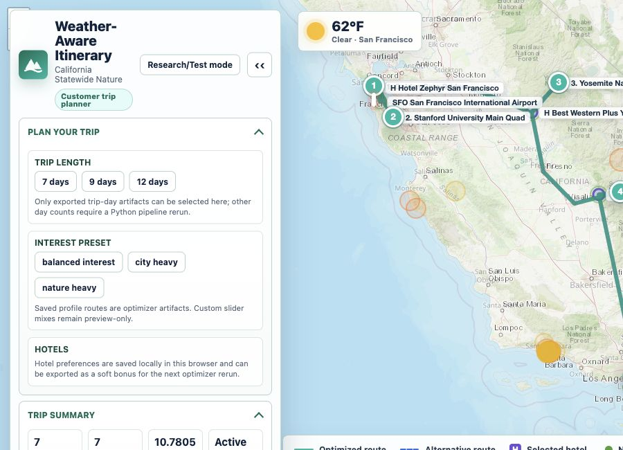
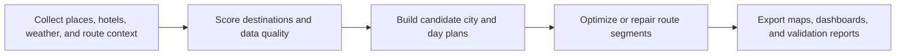

<div align="center">

# Weather-Aware Travel Itinerary Optimization

**A route-planning research tool for building multi-day trips that respect weather, travel time, hotels, budgets, and traveler interests.**

[](https://www.python.org/)
[](https://www.gurobi.com/)
[](https://python-visualization.github.io/folium/)
[](https://www.openstreetmap.org/)

[GitHub Repository](https://github.com/Ztang-Yit-Xiaang/weather-aware-travel-itinerary-optimization)

</div>



## Why This Tool?

Travel planning is not just picking the top-rated attractions. A good itinerary also has to answer very human questions:

- Can I actually visit these places in one day?
- Is the route wasting too much time in the car?
- Should rainy or high-risk outdoor stops be replaced?
- Where should I stay overnight?
- What changes if I want more nature, city, culture, or history?

This project turns those questions into a working research prototype. It collects place and hotel candidates, scores them with context, builds route options, repairs routes with optimization, and exports map dashboards that make the result inspectable.

## What Can It Do?

- Build multi-day California trip plans with city, scenic, and nature-aware stops.
- Compare route strategies such as hierarchical Gurobi, greedy baselines, and hybrid bandit + small Gurobi repair.
- Switch between 7-day, 9-day, and 12-day route artifacts.
- Use a customer-facing trip planner view for quick inspection and a research/test view for deeper debugging.
- Inspect selected hotels, candidate hotels, route variants, map layers, playback, active stop details, city details, nature exploration, and debug summaries.
- Preview interest profiles across nature, city, culture, and history.
- Compare method metrics in a separate evaluation dashboard.
- Export lightweight maps for sharing and larger dashboards for research/debugging.
- Keep data-source uncertainty visible through enrichment and validation artifacts.

## Try The Dashboard

The fastest way to see the project is to serve the generated dashboard locally:

```bash
python scripts/serve_dashboard.py
```

Then open the URL printed in the terminal. The newest generated dashboard folder is:

```text
results/figures/full_interactive_dashboard/
```

Useful entry points:

| Page | Use It For |
| --- | --- |
| `index.html` | Full map dashboard with customer/research mode toggle |
| `customer.html` | Cleaner customer-facing trip planner view |
| `research.html` | Research/test view with route layers, city details, nature exploration, and debug panels |
| `evaluation.html` | Static method-comparison dashboard |

The lightweight share map can also be opened directly:

```text
results/figures/lightweight_share_map.html
```

> GitHub usually will not render local HTML dashboards inline. Serve the repo locally or download/open the HTML files from your machine.

## Run An Optimization Pipeline

Install the project, then execute the production notebook with a trip config:

```bash
pip install -e .

TRIP_CONFIG_PATH="configs/nature_trip_config.yaml" \
python -m jupyter nbconvert \
  --to notebook \
  --execute notebook/production_system_blueprint.ipynb \
  --output production_system_blueprint_nature_executed.ipynb \
  --output-dir notebook \
  --ExecutePreprocessor.timeout=1800 \
  --ExecutePreprocessor.kernel_name=python3
```

Useful validation commands:

```bash
python -m pytest
python scripts/validate_dashboard_export.py
python scripts/validate_nature_route_pipeline.py --strict
```

If you use the Gurobi routes, make sure a valid local Gurobi license is available.

## Current Demo Data

The current generated artifacts focus on a California Statewide Nature demo with a Los Angeles to San Francisco corridor.

| Artifact | Current Snapshot |
| --- | --- |
| Candidate catalog | 228 city/place candidates across San Diego, Los Angeles, Santa Barbara, San Luis Obispo, Monterey, Santa Cruz, and San Francisco |
| Dashboard scenario | California Statewide Nature, nature-heavy interest profile |
| Customer dashboard route | 7-day saved route artifact with 7 visible stops |
| Default route method | Method · Hierarchical + Bandit + Small Gurobi Repair |
| Method CSV snapshot | The method comparison CSV reports 16 selected attractions for the hybrid repair method and about 2041.80 used from a 2213.14 buffered trip budget |
| Route index | 32 route records, including 7 customer-visible options and 25 research-only records |
| Route variants | 7-day, 9-day, and 12-day comparison artifacts |
| Validation summary | `python scripts/validate_dashboard_export.py` passes; `production_map_validation_summary.json` reports 97 PASS checks |

The method comparison artifacts are intentionally research-facing. For example, the evaluation dashboard compares hierarchical Gurobi, hierarchical greedy, and bandit + repair artifacts and keeps solver/status labels visible instead of hiding fallback behavior.

## How It Works



Plain-English version:

1. The pipeline gathers candidate attractions, hotels, nature regions, social must-go places, weather context, and route geometry.
2. It scores places by value, interest fit, scenic/nature signals, detour cost, and data confidence.
3. It proposes route structures across cities and trip lengths.
4. It uses optimization and heuristic repair to produce usable day-by-day route artifacts.
5. It exports customer, research, and evaluation dashboards so a person can inspect the route, not just trust a black-box answer.

## Interest Profiles

The planner separates **pace** from **interest**:

- Pace: relaxed, balanced, explorer.
- Interest: nature, city, culture, history.

Saved profile artifacts currently include balanced, nature-heavy, city-heavy, culture-heavy, and history-heavy score comparisons. Browser-side interest controls are clearly labeled previews; true optimized route changes come from rerunning the Python pipeline.

## Project Structure

```text
weather-aware-travel-itinerary-optimization/
├── configs/                 # Trip and nature-aware planning configs
├── docs/                    # Modeling notes and quality workflow
├── notebook/                # Original and production notebooks
├── report/                  # Final report, proposal drafts, screenshots
├── results/                 # Generated outputs, maps, dashboards, caches
├── scripts/                 # Dashboard serving and validation helpers
├── src/itinerary_system/    # Reusable itinerary planning modules
└── tests/                   # Pipeline and export tests
```

## Documentation

| Document | What It Covers |
| --- | --- |
| [Nature-aware model extension](docs/nature_aware_model_extension.md) | Interest bars, nature regions, route balance, map export architecture |
| [Code quality workflow](docs/code_quality_workflow.md) | Formatting, tests, validation, generated artifact policy |
| [IE 5533 final report](report/IE_5533_Final_Report.pdf) | Original course-report formulation and background |
| [Progress report for Prof. Xie](report/prof_xie_progress_report.pdf) | Current progress, limitations, and research questions |
| [Supervisor proposal](report/chi2027_supervisor_proposal.pdf) | Publication-oriented proposal and supervision request |
| [Faculty match memo](report/cse_faculty_match_memo.pdf) | Potential UMN faculty matches across CS, DS, transportation, ME, and ISyE |
| [Contributing guide](CONTRIBUTING.md) | Setup, checks, artifact policy, and PR expectations |

## Limitations

- The dashboard is a static export. Customer controls can switch saved artifacts or show preview-only routes, but they do not rerun Gurobi in the browser.
- Generated artifacts can become stale after config or code changes. Re-run the pipeline before using the maps as final evidence.
- Live data sources may fall back to cached or curated data. The audit files are part of the research story, not noise to hide.
- Nationwide travel planning is a roadmap. The current strongest demo is California-focused; national-scale routing needs stronger data adapters, route graph generation, and validation.
- Waiting time and congestion are modeled with proxy signals, not direct ground-truth queue measurements.

## Contributing

Contributions are welcome, especially around data adapters, dashboard clarity, validation, and user-study preparation. Start with [CONTRIBUTING.md](CONTRIBUTING.md).

## License

This project is for academic and research purposes. See [LICENSE](LICENSE).
