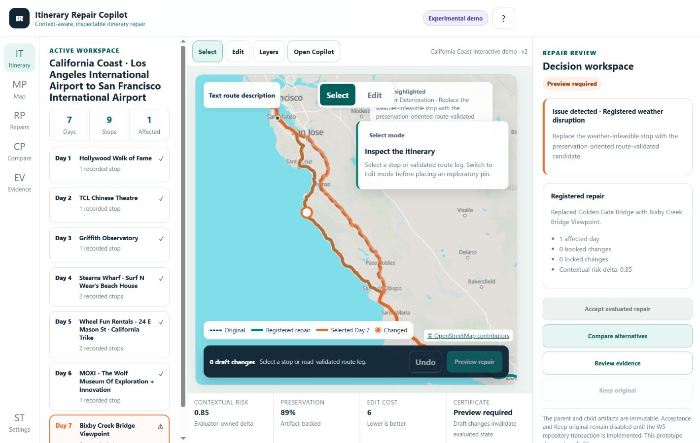
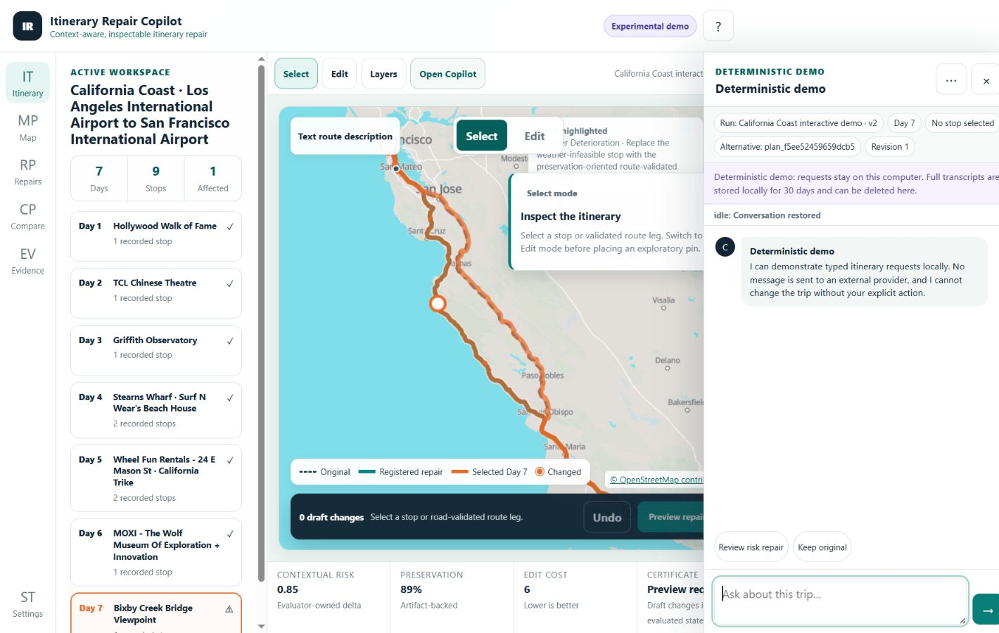
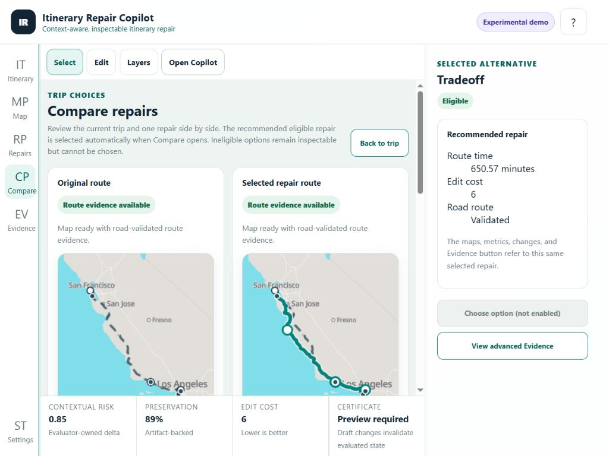
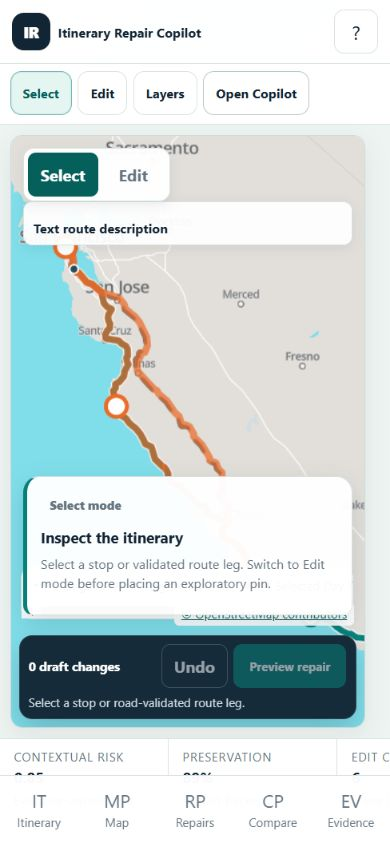

<div align="center">

# Weather-Aware Travel Itinerary Optimization

### Plan less. Adapt smarter. Keep the trip worth taking.

An inspectable research prototype that detects weather disruptions, repairs multi-day itineraries, and explains the tradeoffs between route time, traveler preferences, budget, and feasibility.

[](https://www.python.org/)
[](https://fastapi.tiangolo.com/)
[](https://www.gurobi.com/)
[](https://www.openstreetmap.org/)
[](LICENSE)

[Quick start](#quick-start) · [Demo](#product-walkthrough) · [How it works](#how-it-works) · [Research](#research-and-documentation)

</div>



## What this project does

Travel plans break when weather, closures, travel time, or booking constraints change. This project turns that disruption into a constrained repair problem: preserve as much of the original trip as possible, replace what no longer works, and keep every recommendation inspectable.

- Detects weather-affected stops in a multi-day itinerary.
- Builds route-aware alternatives from place, hotel, weather, and travel-time evidence.
- Balances feasibility, preservation, edit cost, budget, and traveler interests.
- Compares hierarchical Gurobi, greedy, and hybrid bandit + small-Gurobi methods.
- Presents the result in desktop and mobile trip, repair, comparison, and evidence views.
- Offers a local deterministic Copilot; an OpenAI-backed mode is optional and explicit.

> **Prototype status:** `/app` is an experimental research interface, not a booking product. Repair acceptance remains disabled until the repository transaction workflow is implemented and verified.

## Product walkthrough

The animation below is assembled from verified browser captures of the real application. It shows the trip workspace, deterministic Copilot, and side-by-side repair comparison.

<div align="center">


</div>

<table>
  <tr>
    <td width="58%">
      
      <br><sub><b>Explainable assistance.</b> Discuss a disruption without allowing the assistant to silently change the trip.</sub>
    </td>
    <td width="42%">
      
      <br><sub><b>Visible tradeoffs.</b> Compare route evidence, risk, preservation, and edit cost before choosing.</sub>
    </td>
  </tr>
  <tr>
    <td colspan="2" align="center">
      
      <br><sub><b>Responsive inspection.</b> The essential trip and map workflow remains available on a narrow viewport.</sub>
    </td>
  </tr>
</table>

Full-size stability evidence is preserved in [`results/stability_pass_8127/verified_20260810`](results/stability_pass_8127/verified_20260810/).

## Quick start

### Windows launcher

1. Clone or download the repository.
2. Double-click [`OPEN_ITINERARY_COPILOT.cmd`](OPEN_ITINERARY_COPILOT.cmd).
3. Keep the terminal open while using the app at `http://127.0.0.1:8127/app`.
4. Press `Ctrl+C` in the terminal when finished.

The launcher starts a loopback-only service, validates the pinned demo run, waits for its health check, and opens the correct page. Do **not** open `src/itinerary_system/product_app/static/index.html` directly: the page requires the application API and will not work from a `file:///` URL.

### Command line

```powershell
python -m pip install -e .
python scripts/run_product_app.py --open
```

The current product demo reads immutable artifacts from:

```text
runs/e3ux-weather-repair-demo-v6/
```

The older generated research dashboard is still available:

```powershell
python scripts/serve_dashboard.py
```

Open the URL printed in the terminal. GitHub does not render the repository's local HTML dashboards inline, so they must be served or opened locally.

## How it works


```mermaid
flowchart LR
    A["Places, hotels, weather, and routes"] --> B["Context and evidence scoring"]
    B --> C["Candidate day plans"]
    C --> D["Constrained itinerary repair"]
    D --> E["Evaluation and certificates"]
    E --> F["Trip, compare, and evidence views"]
```

1. **Collect context** — Load candidate attractions, hotels, weather signals, road routes, and traveler preferences.
2. **Score candidates** — Measure interest fit, nature and scenic value, detour cost, and data confidence.
3. **Construct alternatives** — Build feasible city and day structures for the requested trip length.
4. **Optimize or repair** — Apply exact, heuristic, or hybrid methods while minimizing unnecessary changes.
5. **Expose evidence** — Export maps, metrics, explanations, and validation artifacts instead of returning a black-box route.

## Demo snapshot

| Dimension | Included in the current demo |
| --- | --- |
| Scenario | Weather-aware California coast itinerary repair |
| Corridor | Los Angeles to San Francisco |
| Trip | 7 days, 9 recorded stops, 1 affected day |
| Candidate catalog | 228 city/place candidates across seven California regions |
| Repair signals | Contextual risk, preservation, edit cost, eligibility, and route evidence |
| Route variants | 7-day, 9-day, and 12-day research artifacts |
| Interfaces | Trip, map edit, repairs, compare, evidence, settings, and Copilot |

The broader generated artifacts also include customer-facing and research/debug dashboards, lightweight share maps, method comparisons, route playback, hotel candidates, nature exploration, and interest-profile previews.

## Run the research pipeline

Install the package, then execute the production notebook with a trip configuration:

```powershell
python -m pip install -e .
$env:TRIP_CONFIG_PATH = "configs/nature_trip_config.yaml"
python -m jupyter nbconvert `
  --to notebook `
  --execute notebook/production_system_blueprint.ipynb `
  --output production_system_blueprint_nature_executed.ipynb `
  --output-dir notebook `
  --ExecutePreprocessor.timeout=1800 `
  --ExecutePreprocessor.kernel_name=python3
```

A valid local Gurobi license is required for Gurobi-backed optimization routes.

## Optional OpenAI Copilot

The Copilot starts in **Deterministic demo** mode. Requests stay on the computer and no API key is needed. To explicitly select the OpenAI adapter, create a local, Git-ignored `.env.local` file:

```dotenv
PRODUCT_COPILOT_ADAPTER=openai
OPENAI_API_KEY=replace-with-your-local-key
OPENAI_COPILOT_MODEL=gpt-5.6-terra
```

The provider receives the visible itinerary context, current message, and a bounded recent conversation window. It has no tools and cannot directly change a plan, booking, permission, or acceptance decision. Local transcripts expire after 30 days and can be deleted from Copilot settings. Never place an API key in a tracked file, screenshot, issue, or chat message.

Inspect the selected provider without making a billed request:

```powershell
$health = Invoke-RestMethod http://127.0.0.1:8127/api/health
$health.components.openai
```

## Project structure

```text
weather-aware-travel-itinerary-optimization/
├── configs/                 Trip and product configurations
├── docs/                    Research, methods, audits, and engineering notes
├── notebook/                Exploration and production notebooks
├── report/                  Course reports, proposals, and presentation material
├── results/                 Generated maps, dashboards, figures, and evidence
├── runs/                    Immutable experiment and product-demo artifacts
├── scripts/                 Launch, export, validation, and pipeline commands
├── src/itinerary_system/    Reusable planning, repair, and product modules
└── tests/                   Pipeline, optimization, API, and interface tests
```

## Validation

Run the full automated suite and static checks:

```powershell
python -m pytest
python -m ruff check src tests scripts
python scripts/validate_dashboard_export.py
python scripts/validate_nature_route_pipeline.py --strict
```

Focused product-app checks:

```powershell
python -m pytest tests/product_app -q
python -m ruff check src/itinerary_system/product_app tests/product_app scripts/run_product_app.py
```

## Research and documentation

Start with the [documentation index](docs/README.md), then use the focused references below.

| Document | Purpose |
| --- | --- |
| [Itinerary repair method](docs/methods/repair_method.md) | Repair thesis, records, experiments, and claim boundaries |
| [Nature-aware model extension](docs/methods/nature_aware_model_extension.md) | Interest profiles, nature regions, route balance, and export architecture |
| [Literature onboarding guide](docs/literature/literature_onboarding_guide.md) | Problem framing, terminology, research gap, and reading path |
| [Evidence matrix](docs/literature/evidence_matrix.md) | Implementation-to-literature traceability and remaining novelty |
| [Product audit synthesis](docs/audits/product_audit_synthesis.md) | Current product failures, evidence, and gate status |
| [Copilot implementation plan](docs/planning/itinerary_repair_copilot_implementation_plan.md) | Product contracts, phases, tests, and verification status |
| [Technical specification](docs/planning/travel_itinerary_repair_technical_specification.md) | Parent-plan-aware repair implementation contract |
| [IE 5533 final report](report/IE_5533_Final_Report.pdf) | Original formulation, methods, and academic background |

## Known limitations

- The strongest current demo is California-focused; nationwide routing requires additional data adapters and validation.
- Some generated dashboards switch between saved artifacts or preview routes but do not rerun Gurobi in the browser.
- Live sources may fall back to cached or curated data; provenance and uncertainty remain visible in audit artifacts.
- Congestion and waiting time use proxy signals rather than direct ground-truth queue measurements.
- Generated artifacts can become stale after code or configuration changes and should be rebuilt before being cited as final evidence.

## Contributing

Contributions are welcome, especially around data adapters, route evidence, optimization baselines, dashboard clarity, and user-study preparation. See [CONTRIBUTING.md](CONTRIBUTING.md) for setup and quality checks.

## License

Released under the [MIT License](LICENSE) for academic and research use.
