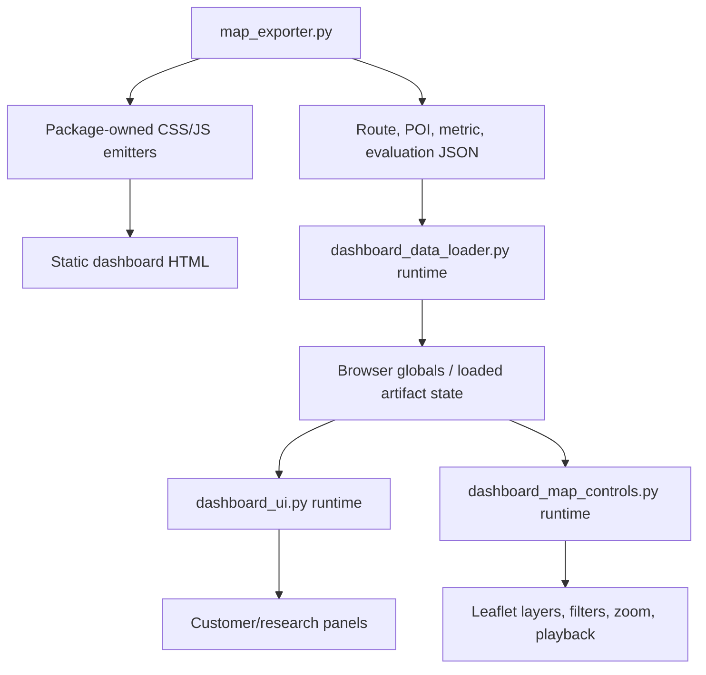

# Dashboard Data Loading

```mermaid
flowchart TD
    Exporter["map_exporter.py"] --> Assets["Package-owned CSS/JS emitters"]
    Exporter --> JSON["Route, POI, metric, evaluation JSON"]
    Assets --> Page["Static dashboard HTML"]
    JSON --> Loader["dashboard_data_loader.py runtime"]
    Loader --> BrowserState["Browser globals / loaded artifact state"]
    BrowserState --> UI["dashboard_ui.py runtime"]
    BrowserState --> Map["dashboard_map_controls.py runtime"]
    UI --> Panels["Customer/research panels"]
    Map --> Leaflet["Leaflet layers, filters, zoom, playback"]
```

