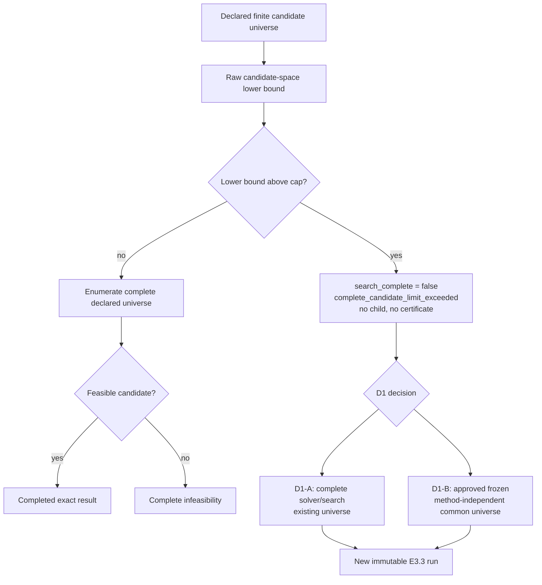

# Exact-Baseline Refusal and D1

```mermaid
flowchart TD
    Universe["Declared finite candidate universe"] --> Bound["Raw candidate-space lower bound"]
    Bound --> Cap{"Lower bound above cap?"}
    Cap -->|yes| Refuse["search_complete = false<br/>complete_candidate_limit_exceeded<br/>no child, no certificate"]
    Cap -->|no| Search["Enumerate complete declared universe"]
    Search --> Result{"Feasible candidate?"}
    Result -->|yes| Complete["Completed exact result"]
    Result -->|no| Infeasible["Complete infeasibility"]
    Refuse --> D1{"D1 decision"}
    D1 --> A["D1-A: complete solver/search<br/>existing universe"]
    D1 --> B["D1-B: approved frozen<br/>method-independent common universe"]
    A --> NewRun["New immutable E3.3 run"]
    B --> NewRun
```

