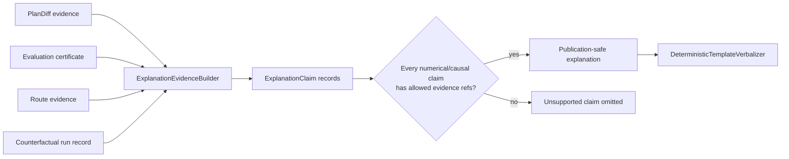

# Explanation Grounding

```mermaid
flowchart LR
    Diff["PlanDiff evidence"] --> Builder["ExplanationEvidenceBuilder"]
    Cert["Evaluation certificate"] --> Builder
    Route["Route evidence"] --> Builder
    Counter["Counterfactual run record"] --> Builder
    Builder --> Claims["ExplanationClaim records"]
    Claims --> Validate{"Every numerical/causal claim<br/>has allowed evidence refs?"}
    Validate -->|yes| Publish["Publication-safe explanation"]
    Validate -->|no| Hide["Unsupported claim omitted"]
    Publish --> Verbalizer["DeterministicTemplateVerbalizer"]
```

