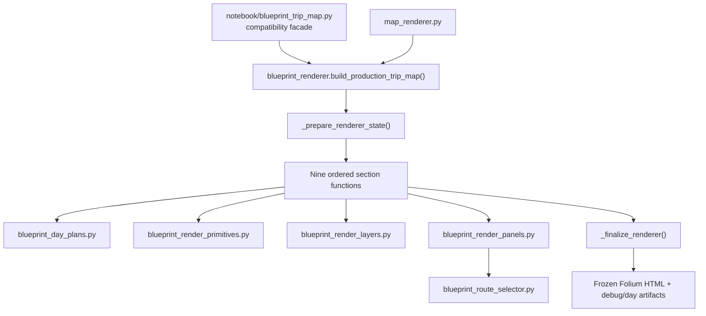

# Folium Renderer Modules

```mermaid
flowchart TD
    Facade["notebook/blueprint_trip_map.py<br/>compatibility facade"] --> Renderer["blueprint_renderer.build_production_trip_map()"]
    MapRenderer["map_renderer.py"] --> Renderer
    Renderer --> State["_prepare_renderer_state()"]
    State --> Sections["Nine ordered section functions"]
    Sections --> Day["blueprint_day_plans.py"]
    Sections --> Primitive["blueprint_render_primitives.py"]
    Sections --> Layers["blueprint_render_layers.py"]
    Sections --> Panels["blueprint_render_panels.py"]
    Panels --> Selector["blueprint_route_selector.py"]
    Sections --> Final["_finalize_renderer()"]
    Final --> HTML["Frozen Folium HTML + debug/day artifacts"]
```

