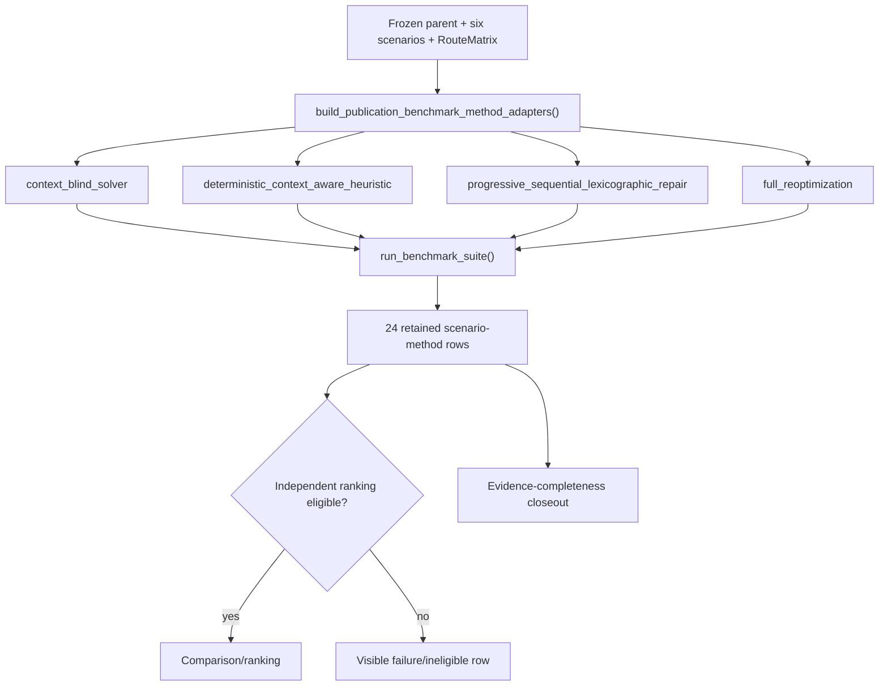

# Four-Method Benchmark Flow

```mermaid
flowchart TD
    Inputs["Frozen parent + six scenarios + RouteMatrix"] --> Factory["build_publication_benchmark_method_adapters()"]
    Factory --> CB["context_blind_solver"]
    Factory --> H["deterministic_context_aware_heuristic"]
    Factory --> P["progressive_sequential_lexicographic_repair"]
    Factory --> F["full_reoptimization"]
    CB --> Suite["run_benchmark_suite()"]
    H --> Suite
    P --> Suite
    F --> Suite
    Suite --> Rows["24 retained scenario-method rows"]
    Rows --> Eligible{"Independent ranking eligible?"}
    Eligible -->|yes| Rank["Comparison/ranking"]
    Eligible -->|no| Failure["Visible failure/ineligible row"]
    Rows --> Closeout["Evidence-completeness closeout"]
```

