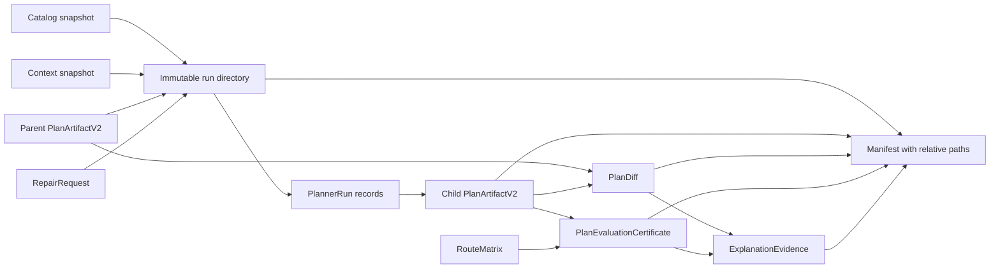

# Immutable Artifact Flow

```mermaid
flowchart LR
    Catalog["Catalog snapshot"] --> Run["Immutable run directory"]
    Context["Context snapshot"] --> Run
    Parent["Parent PlanArtifactV2"] --> Run
    Request["RepairRequest"] --> Run
    Run --> Planner["PlannerRun records"]
    Planner --> Child["Child PlanArtifactV2"]
    Parent --> Diff["PlanDiff"]
    Child --> Diff
    Child --> Cert["PlanEvaluationCertificate"]
    Route["RouteMatrix"] --> Cert
    Diff --> Explain["ExplanationEvidence"]
    Cert --> Explain
    Run --> Manifest["Manifest with relative paths"]
    Child --> Manifest
    Diff --> Manifest
    Cert --> Manifest
    Explain --> Manifest
```

