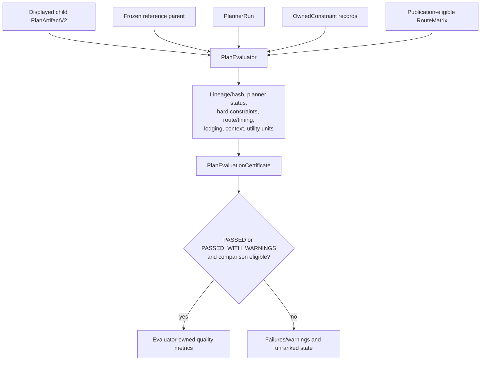

# Independent Evaluation

```mermaid
flowchart TD
    Plan["Displayed child PlanArtifactV2"] --> Evaluator["PlanEvaluator"]
    Parent["Frozen reference parent"] --> Evaluator
    Planner["PlannerRun"] --> Evaluator
    Ownership["OwnedConstraint records"] --> Evaluator
    Route["Publication-eligible RouteMatrix"] --> Evaluator
    Evaluator --> Checks["Lineage/hash, planner status,<br/>hard constraints, route/timing,<br/>lodging, context, utility units"]
    Checks --> Cert["PlanEvaluationCertificate"]
    Cert --> Eligible{"PASSED or PASSED_WITH_WARNINGS<br/>and comparison eligible?"}
    Eligible -->|yes| Metrics["Evaluator-owned quality metrics"]
    Eligible -->|no| Findings["Failures/warnings and unranked state"]
```

