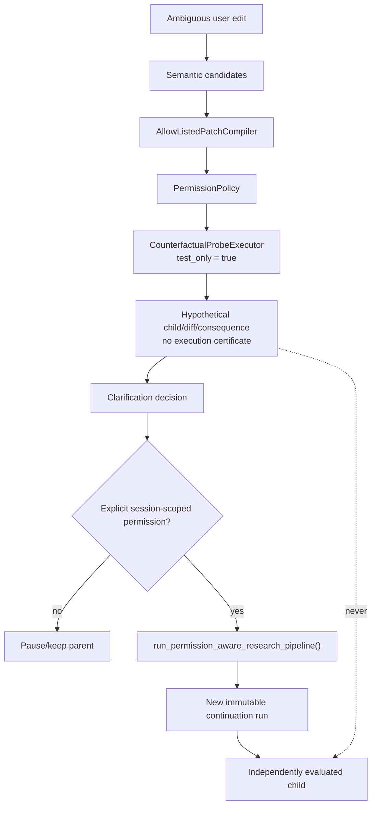

# Interaction Probe vs Authorized Repair

```mermaid
flowchart TD
    Text["Ambiguous user edit"] --> Candidates["Semantic candidates"]
    Candidates --> Patch["AllowListedPatchCompiler"]
    Patch --> Permission["PermissionPolicy"]
    Permission --> Probe["CounterfactualProbeExecutor<br/>test_only = true"]
    Probe --> Hypo["Hypothetical child/diff/consequence<br/>no execution certificate"]
    Hypo --> Clarify["Clarification decision"]
    Clarify --> Decision{"Explicit session-scoped permission?"}
    Decision -->|no| Pause["Pause/keep parent"]
    Decision -->|yes| Continue["run_permission_aware_research_pipeline()"]
    Continue --> NewRun["New immutable continuation run"]
    NewRun --> Accepted["Independently evaluated child"]
    Hypo -. never .-> Accepted
```

