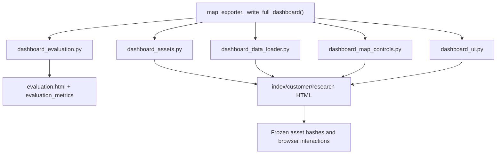

# Modular Dashboard Modules

```mermaid
flowchart TD
    Export["map_exporter._write_full_dashboard()"] --> Eval["dashboard_evaluation.py"]
    Export --> CSS["dashboard_assets.py"]
    Export --> Loader["dashboard_data_loader.py"]
    Export --> Controls["dashboard_map_controls.py"]
    Export --> UI["dashboard_ui.py"]
    Eval --> EvalPage["evaluation.html + evaluation_metrics"]
    CSS --> HTML["index/customer/research HTML"]
    Loader --> HTML
    Controls --> HTML
    UI --> HTML
    HTML --> Contract["Frozen asset hashes and browser interactions"]
```

