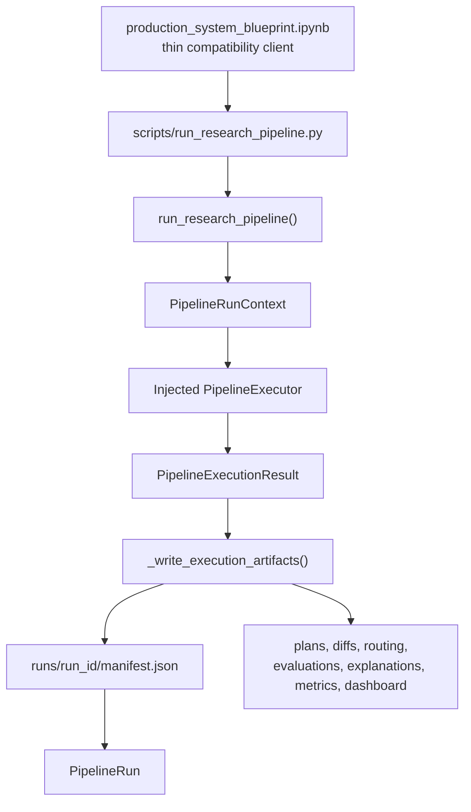

# Package Entry and Pipeline

```mermaid
flowchart TD
    CLI["scripts/run_research_pipeline.py"] --> Runner["run_research_pipeline()"]
    Notebook["production_system_blueprint.ipynb<br/>thin compatibility client"] --> CLI
    Runner --> Context["PipelineRunContext"]
    Context --> Executor["Injected PipelineExecutor"]
    Executor --> Result["PipelineExecutionResult"]
    Result --> Writer["_write_execution_artifacts()"]
    Writer --> Manifest["runs/run_id/manifest.json"]
    Writer --> Artifacts["plans, diffs, routing,<br/>evaluations, explanations, metrics, dashboard"]
    Manifest --> Return["PipelineRun"]
```

