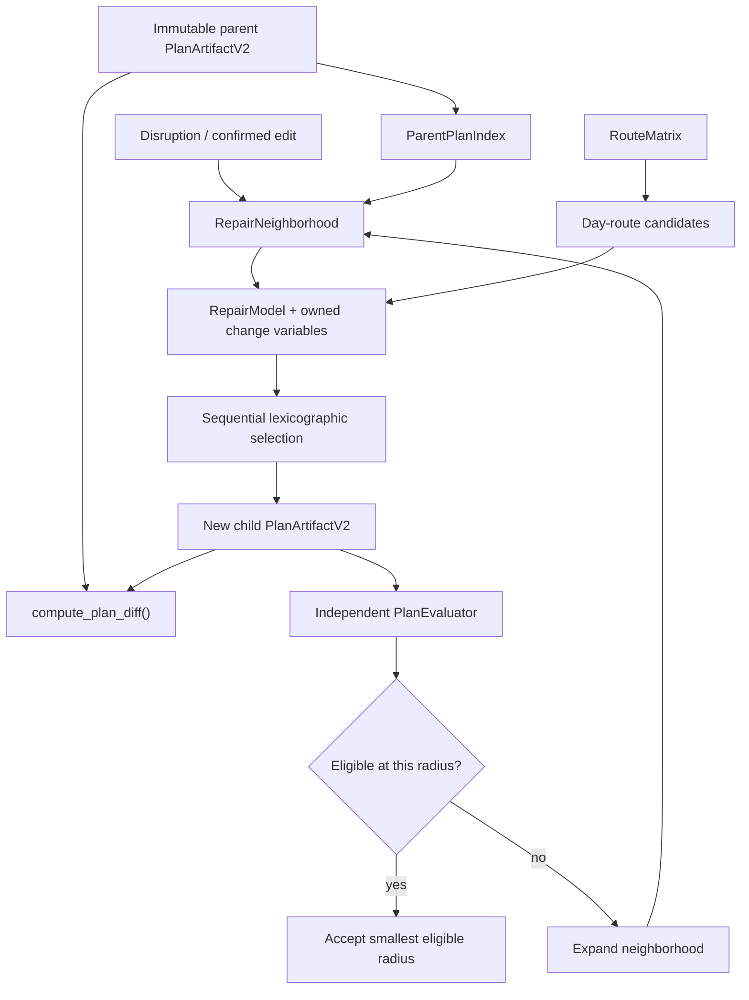

# Parent–Child Repair

```mermaid
flowchart TD
    Parent["Immutable parent PlanArtifactV2"] --> Index["ParentPlanIndex"]
    Edit["Disruption / confirmed edit"] --> Neighborhood["RepairNeighborhood"]
    Index --> Neighborhood
    Neighborhood --> Model["RepairModel + owned change variables"]
    Route["RouteMatrix"] --> Day["Day-route candidates"]
    Day --> Model
    Model --> Lex["Sequential lexicographic selection"]
    Lex --> Child["New child PlanArtifactV2"]
    Parent --> Diff["compute_plan_diff()"]
    Child --> Diff
    Child --> Eval["Independent PlanEvaluator"]
    Eval --> Decision{"Eligible at this radius?"}
    Decision -->|yes| Stop["Accept smallest eligible radius"]
    Decision -->|no| Expand["Expand neighborhood"]
    Expand --> Neighborhood
```

