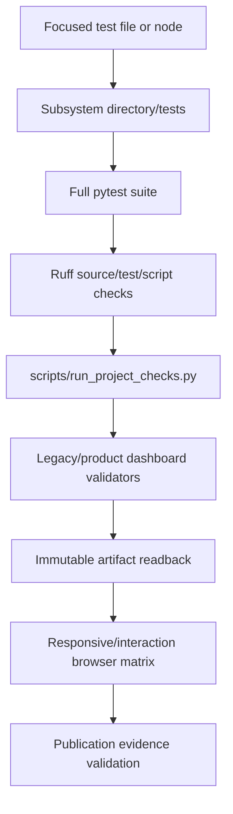

# Test Hierarchy

```mermaid
flowchart TD
    Focus["Focused test file or node"] --> Subsystem["Subsystem directory/tests"]
    Subsystem --> Full["Full pytest suite"]
    Full --> Ruff["Ruff source/test/script checks"]
    Ruff --> Project["scripts/run_project_checks.py"]
    Project --> Dashboard["Legacy/product dashboard validators"]
    Dashboard --> Readback["Immutable artifact readback"]
    Readback --> Browser["Responsive/interaction browser matrix"]
    Browser --> Publication["Publication evidence validation"]
```

