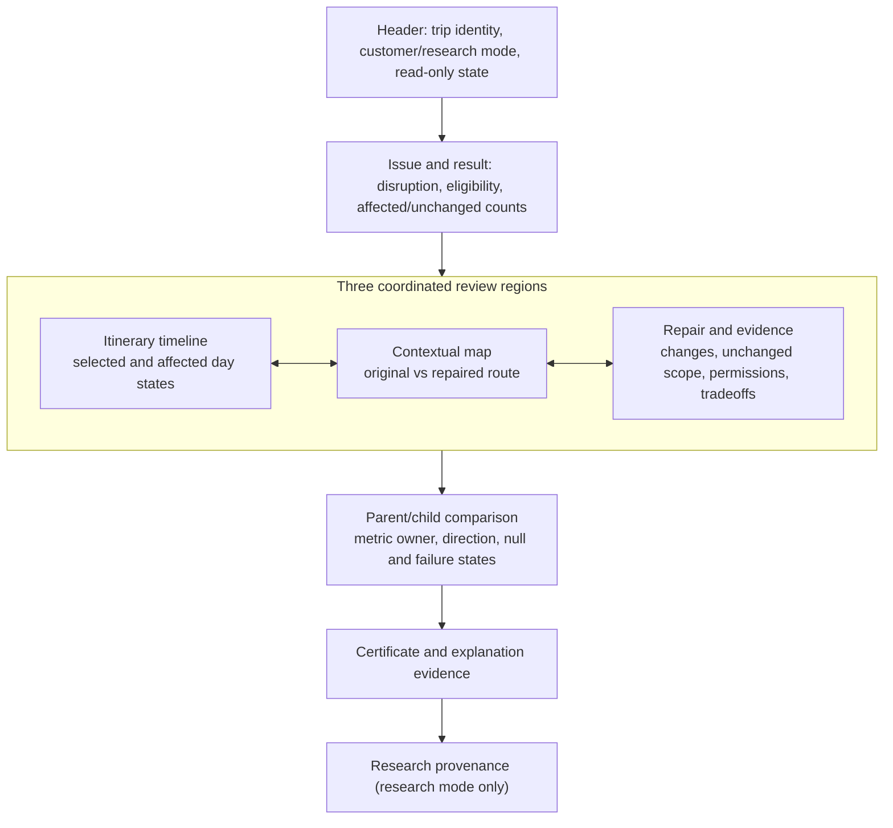
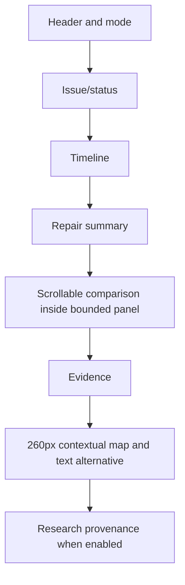
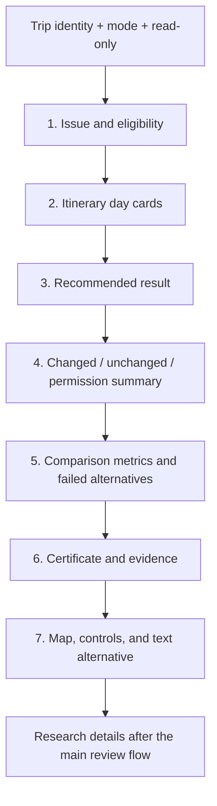

# E3.UX Product Wireframes

These low-fidelity diagrams define reading order and coordination, not pixel
measurements.

## Desktop

```mermaid
flowchart TB
    H["Header: trip identity, customer/research mode, read-only state"]
    I["Issue and result: disruption, eligibility, affected/unchanged counts"]
    subgraph R["Three coordinated review regions"]
      T["Itinerary timeline\nselected and affected day states"]
      M["Contextual map\noriginal vs repaired route"]
      P["Repair and evidence\nchanges, unchanged scope, permissions, tradeoffs"]
    end
    C["Parent/child comparison\nmetric owner, direction, null and failure states"]
    E["Certificate and explanation evidence"]
    X["Research provenance (research mode only)"]
    H --> I --> R --> C --> E --> X
    T <--> M
    M <--> P
```

## Tablet

```mermaid
flowchart TB
    H["Header and mode"]
    I["Issue/status"]
    T["Timeline"]
    P["Repair summary"]
    C["Scrollable comparison inside bounded panel"]
    E["Evidence"]
    M["260px contextual map and text alternative"]
    X["Research provenance when enabled"]
    H --> I --> T --> P --> C --> E --> M --> X
```

## Mobile

```mermaid
flowchart TB
    H["Trip identity + mode + read-only"]
    I["1. Issue and eligibility"]
    T["2. Itinerary day cards"]
    P["3. Recommended result"]
    D["4. Changed / unchanged / permission summary"]
    C["5. Comparison metrics and failed alternatives"]
    E["6. Certificate and evidence"]
    M["7. Map, controls, and text alternative"]
    X["Research details after the main review flow"]
    H --> I --> T --> P --> D --> C --> E --> M --> X
```

