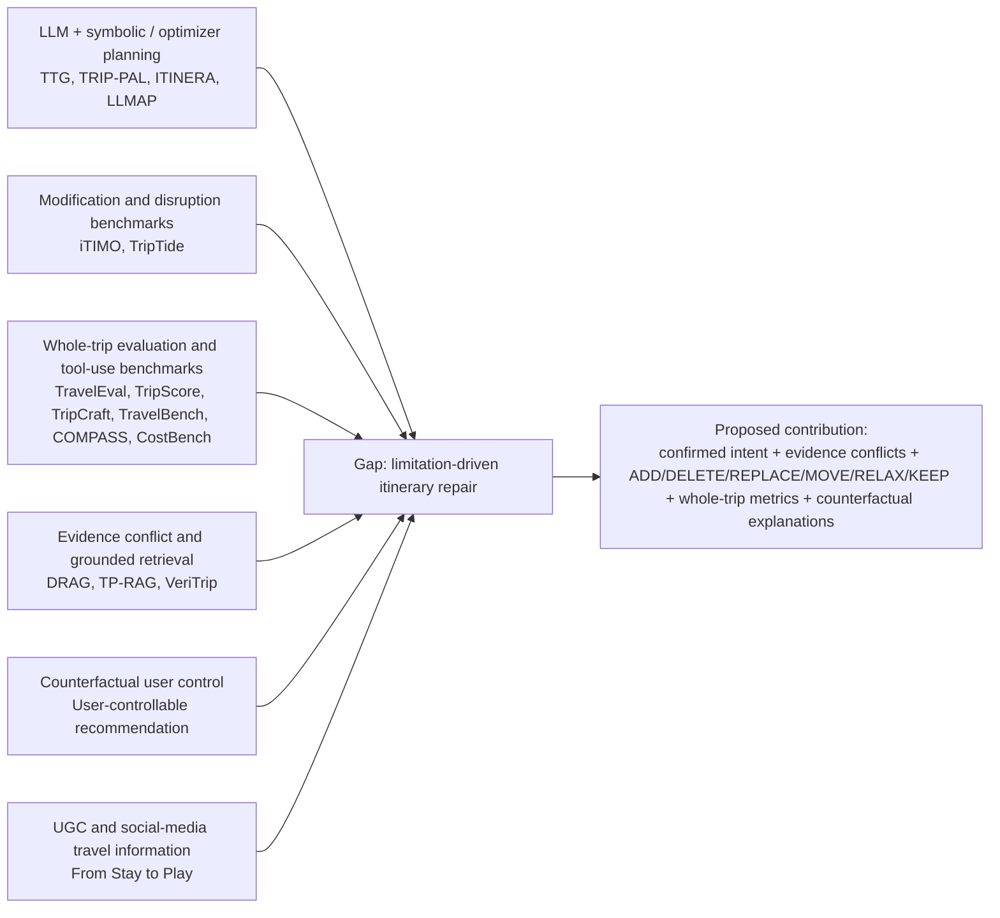

# Related Work Outline

This is an outline for a future paper. It is not polished prose. Its job is to show what each subsection must accomplish, which citations are essential, which citations are optional, what claims still need evidence, and how each subsection leads to the research gap.

Working research gap:

> Temporal, user-specific, evidence-conflict-aware, counterfactual minimal-change repair for weather-sensitive multi-day itineraries.

Working primary research question:

> How can a solver/evaluator-backed repair planner revise disrupted multi-day itineraries while preserving user intent, exposing evidence conflicts, and giving travelers counterfactual control over route tradeoffs?

## Search Methodology Snapshot

**Review type:** scoped narrative review for a publication idea, not a complete PRISMA systematic review.

**Date updated:** 2026-07-02.

**Sources checked:** local PDF corpus and generated summaries in `reference/`; arXiv-focused web searches for 2024-2026 travel-planning, itinerary-modification, RAG-conflict, and counterfactual recommendation papers; DOI/PDF metadata for the local "From Stay to Play" paper.

**Search concepts:**

1. LLM travel planning and language-to-symbolic optimization.
2. Itinerary modification, disruption revision, and minimal-change repair.
3. Whole-trip evaluation and plan-grounded interaction.
4. Conflict-aware retrieval and evidence-grounded planning.
5. Counterfactual and user-controllable recommendation.
6. Social-media/UGC travel information and route planning.

**Inclusion criteria:** English-language peer-reviewed papers and preprints directly relevant to travel planning, itinerary recommendation, route optimization, travel-agent evaluation, disruption revision, evidence conflict, or counterfactual user control.

**Exclusion criteria:** generic recommender or routing papers without itinerary/travel relevance, travel-agent product pages without a paper, and papers whose only relevance is general LLM prompting.

**Screening outcome:** the closest novelty threats are TTG, TRIP-PAL, ITINERA, LLMAP, iTIMO, TripTide, TravelEval, TripScore, TravelBench, COMPASS, CostBench, TP-RAG, VeriTrip, DRAGged into Conflicts, user-controllable counterfactual recommendation, and From Stay to Play. None subsumes the complete proposed repair formulation, but each removes one broad claim from the novelty space.

**Figure note:** AI-generated schematic created with the available `imagegen` skill on 2026-07-02 and saved at `docs/figures/literature_repair_gap_schematic.png`. The Mermaid diagram above is the exact reproducible source-of-truth version for labels and relationships; the raster figure is included as the required visual literature-review schematic.

## 2.1 Tourist Trip Design and Constrained Optimization

**Purpose in the paper**

Establish that travel itinerary planning is a constrained selection-and-sequencing problem, not a ranked-list recommendation problem. This subsection should give the operations-research foundation for why routes need formal feasibility checks.

**Logical argument**

1. Tourists cannot visit every attractive location, so the system must select a subset of POIs.
2. The selected POIs must be sequenced into feasible days under time, distance, budget, and lodging constraints.
3. The Orienteering Problem (OP) captures the basic idea of maximizing collected value under a route budget.
4. The Tourist Trip Design Problem (TTDP) extends OP toward tourism-specific constraints such as multi-day planning, time windows, mandatory visits, categories, and practical routing.
5. Rich TTDP work shows that realistic travel constraints are technically difficult and require explicit feasibility handling.
6. However, this literature usually focuses on algorithms and computational performance, not whether travelers understand the solver's tradeoffs.

**Essential citations**

- Vansteenwegen, Souffriau, and Van Oudheusden (2011), "The Orienteering Problem: A Survey."
- Ruiz-Meza and Montoya-Torres (2022), "A Systematic Literature Review for the Tourist Trip Design Problem."
- Vu, Kergosien, Mendoza, and Desport (2022), "Branch-and-Check Approaches for the Tourist Trip Design Problem with Rich Constraints."

**Optional citations**

- Gunawan, Lau, and Vansteenwegen (2016), "Orienteering Problem: A Survey of Recent Variants, Solution Approaches and Applications."
- Route recommendation survey (`2403.00284v2.pdf`) for broader route recommendation context.

**Claims that still require evidence**

- That this project's route artifacts are feasible under the implemented model.
- That the project's solver-backed routes outperform greedy or heuristic baselines on route quality.
- That the current formulation handles all real-world tourism constraints. It does not; it handles a defined subset.

**How this subsection leads to our research gap**

End by saying that TTDP/OP gives the feasibility foundation, but feasible output alone does not make the route understandable or revisable to a traveler. This motivates the need for an inspectable interface that exposes constraints, alternatives, and solver/fallback status.

## 2.2 Personalized and Context-Aware Itinerary Recommendation

**Purpose in the paper**

Explain how systems estimate which places a traveler may like, and why preference-aware scoring must still be combined with route feasibility.

**Logical argument**

1. Travel plans should reflect traveler interests, not only generic popularity.
2. Personalized itinerary recommendation combines POI utility, user preferences, context, and route construction.
3. Context such as time, queueing, weather, seasonality, and crowding changes the value or cost of a POI.
4. Predicting attractive POIs is necessary but not sufficient: high-utility POIs may be infeasible because of travel time, budget, weather risk, or lodging constraints.
5. The current project uses interest profiles and weather-risk-aware scoring to connect personalization with constrained planning.
6. The remaining gap is making those personalization and context signals inspectable to the user.

**Essential citations**

- Halder, Lim, Chan, and Zhang (2024), "A Survey on Personalized Itinerary Recommendation: From Optimisation to Deep Learning."
- Lim, Chan, Karunasekera, and Leckie (2017), "Personalized Itinerary Recommendation with Queuing Time Awareness."
- Zhou, Wang, and Li (2017), "From Stay to Play: A Travel Planning Tool Based on Crowdsourcing User-Generated Contents."

**Optional citations**

- Borras, Moreno, and Valls (2014), "Intelligent Tourism Recommender Systems: A Survey."
- Yuan et al. (2013), "Time-Aware Point-of-Interest Recommendation."
- TripTide (2025) for weather/closure disruptions as adaptive planning triggers.
- BTRec (2023), +Tour (2025), Vaiage (2025), Collab-Rec (2025), and SynthTRIPs (2025) as recent personalization or agentic baselines.

**Claims that still require evidence**

- That this project's interest profile produces routes users prefer.
- That weather-risk scoring improves objective or subjective route quality.
- That browser-side interest previews are adequate for user decision-making.
- That the modeled weather-risk values match real weather outcomes.

**How this subsection leads to our research gap**

End by emphasizing that personalization and context signals become useful only when travelers can see how they affect feasible route choices. This leads to the need for explanations such as why a high-interest outdoor stop was skipped under weather risk.

## 2.3 LLM and Solver-Backed Travel Planning

**Purpose in the paper**

Position the project against recent LLM travel-planning work. The goal is not to build an LLM-only travel agent, but to show why constraint validation, symbolic planning, and inspectable route artifacts matter.

**Logical argument**

1. LLMs make travel planning feel conversational and convenient.
2. Recent benchmarks show that LLM-only travel plans can violate constraints, miss spatial or temporal details, mishandle lodging and transportation, or produce plausible but invalid itineraries.
3. Hybrid systems such as TRIP-PAL, TTG, and LLMAP show a more promising path: use language models to extract information or compile constraints, then use symbolic planning, graph search, or mixed-integer optimization for validation and route construction. Logic-LM supplies a broader neuro-symbolic precedent for solver-error-guided correction of bad formalizations.
4. ITINERA shows that LLM plus spatial optimization is already established for open-domain urban itinerary generation, so "LLM plus optimizer" cannot be the novelty claim.
5. Evaluation is also becoming more complete: TravelEval argues for assessing full travel plans across accuracy, compliance, temporality, spatiality, economy, and utility, while TripScore combines hard, soft, and preference criteria into an expert-calibrated reward.
6. The current project already follows part of the hybrid logic by keeping route artifacts and solver/fallback status inspectable, even though it does not currently include a natural-language LLM layer.
7. This creates a future path: natural-language preferences could be compiled into explicit, auditable constraints, but the current paper should focus on inspectable solver-backed repair rather than claiming an autonomous LLM agent.

**Essential citations**

- Xie et al. (2024), "TravelPlanner: A Benchmark for Real-World Planning with Language Agents."
- de la Rosa et al. (2024), "TRIP-PAL: Travel Planning with Guarantees by Combining Large Language Models and Automated Planners."
- Ju et al. (2024), "To the Globe (TTG): Towards Language-Driven Guaranteed Travel Planning."
- Tang et al. (2024), "ITINERA: Integrating Spatial Optimization with Large Language Models for Open-domain Urban Itinerary Planning."
- Yuan et al. (2025), "LLMAP: LLM-Assisted Multi-Objective Route Planning with User Preferences."
- Chen et al. (2026), "TravelEval: A Comprehensive Benchmarking Framework for Evaluating LLM-Powered Travel Planning Agents."
- Qu et al. (2025), "TripScore: Benchmarking and Rewarding Real-World Travel Planning with Fine-Grained Evaluation."

**Optional citations**

- Chen et al. (2024), "Can We Rely on LLM Agents to Draft Long-Horizon Plans?"
- Chen et al. (2024), "TravelAgent."
- Zhang et al. (2026), "Revisiting the Travel Planning Capabilities of Large Language Models."
- Pan et al. (2023), "Logic-LM: Empowering Large Language Models with Symbolic Solvers for Faithful Logical Reasoning."
- TripCraft (2025), TP-RAG (2025), ChinaTravel (2024), TravelBench (2025), COMPASS (2025), CostBench (2025), and GroupTravelBench (2026) for increasingly realistic planning/evaluation settings.

**Claims that still require evidence**

- That this project is an LLM travel agent. It is not currently implemented as one.
- That natural-language preferences are parsed into validated optimization constraints.
- That solver-backed planning outperforms LLM-only planning in this repository.
- That the planner provides formal guarantees beyond the implemented model and solver status.
- That a unified itinerary reward is objective or sufficient without reporting its component metrics and calibration uncertainty.

**How this subsection leads to our research gap**

End by arguing that modern travel planning needs more than fluent output. It needs validated constraints, explicit route artifacts, uncertainty display, and user-facing inspection. This supports the project's focus on accountable and inspectable planning under weather and disruption uncertainty.

## 2.4 Itinerary Modification, Disruption Repair, and Evidence Conflict

**Purpose in the paper**

Show that the proposed contribution is not initial itinerary generation. It is a repair formulation triggered by weather, closure, delay, lodging, evidence, or user-control conflicts.

**Logical argument**

1. iTIMO makes itinerary modification explicit through ADD, DELETE, and REPLACE perturbations, so modification vocabulary itself is not novel.
2. TripTide evaluates LLM itinerary revisions under disruptions and introduces preservation, responsiveness, and adaptability metrics, so disruption revision itself is not novel.
3. TP-RAG and VeriTrip show that travel agents increasingly need grounded retrieval and robustness to noisy or contradictory evidence.
4. DRAGged into Conflicts shows that conflicting retrieved sources require explicit conflict detection and response policies, but it is not a route-optimization method.
5. User-controllable counterfactual recommendation shows that counterfactual explanations can support control, but not under multi-day route feasibility, lodging, weather, and preservation constraints.
6. From Stay to Play shows that UGC/social-media travel data can support hotel, attraction, and route decisions, so UGC integration itself is not novel.
7. The gap is the combination: confirmed intent, evidence-conflict labels, repair operations, minimal-change objective, hard feasibility gates, whole-trip metrics, and counterfactual explanations for disrupted multi-day routes.

**Essential citations**

- Huang et al. (2026), "iTIMO: An LLM-empowered Synthesis Dataset for Travel Itinerary Modification."
- Karmakar et al. (2025), "TripTide: A Benchmark for Adaptive Travel Planning under Disruptions."
- Ni et al. (2025), "TP-RAG: Benchmarking Retrieval-Augmented Large Language Model Agents for Spatiotemporal-Aware Travel Planning."
- Xu et al. (2026), "VeriTrip: A Verifiable Benchmark for Travel Planning Agents over Unstructured Web Corpora."
- Cattan et al. (2025), "DRAGged into Conflicts: Detecting and Addressing Conflicting Sources in Search-Augmented LLMs."
- Tan et al. (2023), "User-Controllable Recommendation via Counterfactual Retrospective and Prospective Explanations."

**Optional citations**

- Zhou, Wang, and Li (2017), "From Stay to Play: A Travel Planning Tool Based on Crowdsourcing User-Generated Contents."
- Dynamic public-transport replanning work for non-tourism replanning precedent.

**Claims that still require evidence**

- That the proposed repair planner preserves more original intent than full replanning or heuristic repair.
- That evidence-conflict labels lead to better route choices or fewer inappropriate changes.
- That counterfactual explanations improve comprehension, control, or error detection.
- That the system handles live evidence; current experiments should use frozen evidence snapshots.

**How this subsection leads to our research gap**

End by saying that prior work covers pieces of the repair problem, but does not yet provide an executable, solver/evaluator-backed, evidence-conflict-aware, counterfactual repair mechanism for weather-sensitive multi-day trips.

## 2.5 Explainable and Mixed-Initiative Travel Decision Support

**Purpose in the paper**

Explain why feasible output is not enough. Travelers need to understand, compare, challenge, and revise the recommendation.

**Logical argument**

1. Mixed-initiative systems should share control between human and system rather than fully automate the decision.
2. Human-AI guidelines emphasize making capabilities, limitations, uncertainty, and correction paths visible.
3. Explainable recommender research shows that explanations serve different goals, including transparency, scrutability, effectiveness, satisfaction, and trust calibration.
4. Visual analytics research shows that interactive displays can help users inspect data, alternatives, process, and provenance.
5. Recent explainable travel recommenders such as CityHood show that travel recommendation interfaces are moving toward user-facing explanations, but they do not solve constrained multi-day route tradeoffs.
6. The project's opportunity is to make route tradeoffs explainable: why selected, why skipped, what would change, and how weather-adjusted alternatives preserve or change the original intent.

**Essential citations**

- Horvitz (1999), "Principles of Mixed-Initiative User Interfaces."
- Amershi et al. (2019), "Guidelines for Human-AI Interaction."
- Tintarev and Masthoff (2007), "A Survey of Explanations in Recommender Systems."
- Knijnenburg et al. (2012), "Explaining the User Experience of Recommender Systems."
- Chen and Pu (2012), "Critiquing-Based Recommenders."
- Chatti, Guesmi, and Muslim (2024), "Visualization for Recommendation Explainability."
- Santos et al. (2025), "CityHood."

**Optional citations**

- Shneiderman (2020), "Human-Centered Artificial Intelligence."
- Bucinca, Malaya, and Gajos (2021), "To Trust or to Think."
- Heer and Shneiderman (2012), "Interactive Dynamics for Visual Analysis."
- Endert et al. (2017), "The State of the Art in Integrating Machine Learning into Visual Analytics."
- Sacha et al. (2017), "What You See Is What You Can Change."
- TRACE (2026) for accountable tourism recommendation and rejection recovery.
- Wardatzky et al. (2025), "Whom do Explanations Serve?"

**Claims that still require evidence**

- That explanations improve user comprehension.
- That route comparison improves decision accuracy.
- That users feel more control.
- That trust is better calibrated.
- That the interface reduces overreliance on the system.
- That users make higher-quality revisions.

**How this subsection leads to our research gap**

End by stating that the project fills a gap between optimization and interaction: prior work can generate or recommend itineraries, but travelers still need an accountable interface for understanding and revising solver-backed route tradeoffs under weather and disruption uncertainty.

## Bridge Paragraph For The Future Paper

After these subsections, the related-work section can transition to the project contribution:

Existing TTDP and recommender systems provide methods for constructing and personalizing itineraries, while recent LLM travel-planning work highlights the importance of constraint validation and complete-plan evaluation. Modification and disruption benchmarks show that routes must be revised, while conflict-aware RAG and counterfactual recommendation show that evidence and user control matter. However, these threads do not yet converge on a solver/evaluator-backed repair method that minimally changes a multi-day route under weather-sensitive constraints while exposing evidence conflicts and counterfactual tradeoffs. We therefore frame the contribution as limitation-driven itinerary repair rather than as another LLM travel agent.
