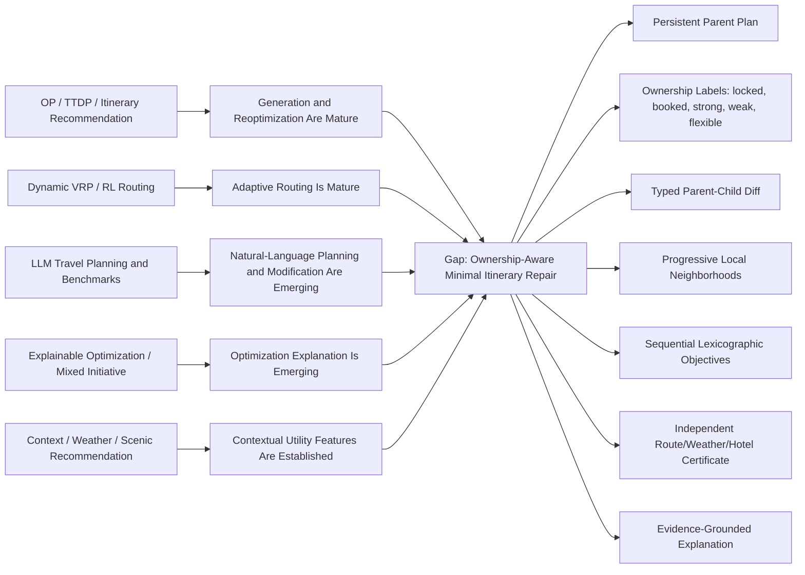

# Repair Literature Gap Map

```mermaid
flowchart LR
    A["OP / TTDP / Itinerary Recommendation"] --> G["Generation and Reoptimization Are Mature"]
    B["Dynamic VRP / RL Routing"] --> H["Adaptive Routing Is Mature"]
    C["LLM Travel Planning and Benchmarks"] --> I["Natural-Language Planning and Modification Are Emerging"]
    D["Explainable Optimization / Mixed Initiative"] --> J["Optimization Explanation Is Emerging"]
    E["Context / Weather / Scenic Recommendation"] --> K["Contextual Utility Features Are Established"]

    G --> Z["Gap: Ownership-Aware Minimal Itinerary Repair"]
    H --> Z
    I --> Z
    J --> Z
    K --> Z

    Z --> L["Persistent Parent Plan"]
    Z --> M["Ownership Labels: locked, booked, strong, weak, flexible"]
    Z --> N["Typed Parent-Child Diff"]
    Z --> O["Progressive Local Neighborhoods"]
    Z --> P["Sequential Lexicographic Objectives"]
    Z --> Q["Independent Route/Weather/Hotel Certificate"]
    Z --> R["Evidence-Grounded Explanation"]
```
