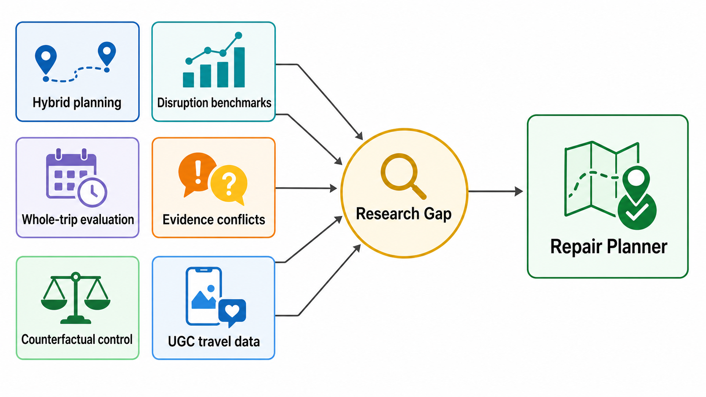

# Literature Review and Repair Gap Framing

Working title: Repair, Do Not Regenerate: Ownership-Aware Minimal Itinerary Repair under Travel Disruptions

Search date: 2026-07-04. This review was prepared as a scoping synthesis, not a full systematic review. It now absorbs the former repair search log, repair comparison matrix, novelty memo, and score-audit summary so this is the canonical repair-gap literature document.



## Scope and Review Question

The project has shifted from weather-aware itinerary generation toward a narrower and more defensible contribution: repairing an already accepted itinerary after disruptions. The central literature question is:

> What is missing from existing itinerary optimization, adaptive routing, LLM travel planning, and explainable optimization work if the artifact to be repaired is a user-owned itinerary with locked, booked, preferred, and flexible commitments?

The short answer is that prior work strongly covers route/POI optimization, contextual recommendation, dynamic vehicle routing, LLM generation/evaluation, and optimization explanation as separate streams. It does not yet provide a tightly specified architecture in which a parent itinerary is a persistent object, changes are typed and ownership-weighted, repair proceeds through progressively larger local neighborhoods, objectives are solved lexicographically with preservation before utility, final plans are independently certified, and explanations are grounded in plan diffs, constraints, route evidence, and counterfactual repair attempts.

## Search and Evidence Notes

The searched concepts were minimal-change itinerary repair, counterfactual itinerary repair, solver-backed itinerary repair, weather itinerary repair, itinerary modification operations, evidence-conflict travel planning, conflicting-source RAG, dynamic replanning, and social-media/UGC travel planning. The checked surfaces included the local PDF corpus, local generated paper summaries, arXiv-focused searches, DOI/PDF metadata for key leads, ACL/ACM/ScienceDirect-style metadata where available, and repository documents.

No searched phrase matched the full proposed method. That absence is only negative evidence, so the claim must be made as a scoped closest-work distinction rather than as proof that no adjacent work exists.

| Closest threat | What it owns | Boundary for this project |
|---|---|---|
| iTIMO | Itinerary modification framing and ADD/DELETE/REPLACE vocabulary | Does not provide solver-backed temporal repair with ownership, lodging, MOVE/RELAX/KEEP, and independent certification. |
| TripTide | Disruption-revision benchmark and preservation/adaptability metrics | Evaluates LLM revisions rather than a mathematical minimal-change repair optimizer. |
| TTG, TRIP-PAL, ITINERA, LLMAP | LLM-plus-symbolic or LLM-plus-optimizer travel planning | Strong precedent for bounded language interfaces, but focused on generation/search rather than parent-child disruption repair. |
| TravelEval, TripScore, TripCraft | Whole-plan evaluation and travel benchmark metrics | Useful evaluator vocabulary, not a repair mechanism. |
| VeriTrip, TP-RAG, DRAGged into Conflicts, CONFACT | Evidence conflicts, noisy retrieval, and grounded reasoning | Relevant warning against broad conflict-handling claims, but not route-constrained itinerary repair. |
| User-controllable counterfactual recommendation | Counterfactual user control | Supports explanation framing, but not constrained itinerary repair. |
| From Stay to Play | UGC hotel, attraction, and route evidence | Background for evidence sources, not a disruption-repair method. |

## Synthesis by Stream

### 1. Conventional TTDP, Orienteering, and Recommender Systems

Tourist trip design is commonly modeled with the Orienteering Problem (OP), Team Orienteering Problem (TOP), or TTDP variants: choose and schedule POIs under time, cost, distance, and preference constraints. Foundational surveys by Vansteenwegen et al. (2011), Gunawan et al. (2016), and Ruiz-Meza and Montoya-Torres (2022) establish that this line of work is mature in modeling variants and solution methods. Recent itinerary recommender surveys such as Halder et al. (2024) expand the lens from exact and heuristic optimization to deep learning, personalization, and sequence recommendation.

The project can use this stream as the optimization backbone, but not as the novelty claim. OP/TTDP work usually asks "what itinerary should be generated?" rather than "what is the smallest acceptable child plan of this parent plan?" Even when models include time windows, queueing, weather, social popularity, or scenic preferences, the original accepted plan usually disappears as a constraint-bearing object. There is no standard notion of locked or booked commitments with asymmetric penalties for moving, replacing, deleting, or reordering them.

Context-aware recommender systems provide useful feature ideas. Braunhofer et al. (2013) show that weather can be used as recommendation context in tourism. Lim et al. (2017) add queueing-time awareness to itinerary recommendation. Quercia et al. (2014) show that route pleasantness can be optimized with social/crowdsourced signals. These papers support the current project's score features, but they should not be framed as evidence that weather-aware or scenic routing is novel.

### 2. Adaptive, Dynamic, and RL Routing

Dynamic vehicle routing research addresses online information, stochastic requests, travel-time changes, and reoptimization. Pillac et al. (2013) and Psaraftis et al. (2016) are the strongest survey anchors. RL routing work, including Nazari et al. (2018), Kool et al. (2019), and Gama and Fernandes (2021), learns policies or heuristics for generating high-quality routing decisions under distributions of problem instances.

This stream helps justify the disruption setting, but it is not the same problem. Dynamic VRP and learned routing generally optimize fleet or sequence decisions, not human-facing itinerary repair where preserving the accepted artifact is itself a primary objective. RL papers often evaluate reward, cost, feasibility, or generalization; they rarely report parent-child edit distance, locked commitment preservation, explanation evidence coverage, or independently road-certified repair eligibility. The proposed contribution should therefore be positioned as a repair semantics and evaluation framework built over optimization, not as a new RL route solver.

### 3. LLM Travel Planning, Modification, and Evaluation

Recent LLM travel papers have moved quickly. TravelPlanner (Xie et al., 2024) provides a benchmark for language agents over real-world travel planning constraints. TTG (Ju et al., 2024) translates natural language into symbolic form and solves with MILP to produce guaranteed itineraries. TRIP-PAL (de la Rosa et al., 2024) combines LLMs with automated planners. ITINERA (Tang et al., 2024) combines spatial optimization and LLMs for open-domain urban itinerary planning.

The most relevant recent shift is itinerary modification and disruption evaluation. iTIMO (Huang et al., 2026) formally defines travel itinerary modification and creates synthetic modification data with atomic ADD, DELETE, and REPLACE perturbations. TripTide (Karmakar et al., 2025) benchmarks adaptive travel planning under disruptions and introduces metrics around intent preservation, responsiveness, and adaptability. TripScore (Qu et al., 2025) and TravelEval (Chen et al., 2026) broaden fine-grained evaluation of LLM-powered travel planning.

These papers make the repair direction timely, but also make overclaiming risky. The defensible gap is not "first itinerary modification" or "first disruption-aware benchmark." The gap is that recent LLM systems and benchmarks usually evaluate text or plan outputs from agents, not a solver-certified parent-child repair process with ownership labels, progressive local neighborhoods, sequential lexicographic objectives, independent road-valid certification, and evidence-grounded explanations tied to a typed diff.

In the proposed architecture, the LLM should be a bounded interpreter of user requests and explanation questions, not the planner or evaluator. A safe typed edit schema is:

```json
{
  "edit_type": "move_stop | lock_stop | avoid_weather | replace_stop | add_must_visit | test_only",
  "target": "...",
  "desired_value": "...",
  "strength": "locked | booked | strong | weak | flexible | test_only",
  "requires_confirmation": true,
  "evidence_needed": ["parent_plan", "weather_snapshot", "route_matrix", "hotel_snapshot"],
  "explanation_question": "why did this change?"
}
```

This framing lets the project borrow LLM usability while keeping optimization, validation, and accountability in typed artifacts.

### 4. Explainability and Mixed Initiative Planning

Mixed-initiative interaction and recommender explanation are important for user-facing repair. Horvitz (1999) provides the classic grounding for systems in which people and machines share initiative. Critiquing-based recommenders and explanation surveys show that users need to understand why alternatives are suggested and how preferences shape outcomes.

Optimization explanation is newer and more directly relevant. OptiChat (Chen et al., 2025) uses LLMs to help practitioners interpret optimization models, diagnose infeasibility, analyze sensitivity, evaluate modifications, and obtain counterfactual explanations. CLEMO (Otto et al., 2025) proposes coherent local explanations for mathematical optimization, including vehicle routing examples.

This supports the explanation side of the contribution, but the project's explanation novelty must stay specific. It should not claim to invent explainable optimization. It should claim that itinerary repair explanations are grounded in a typed parent-child plan diff, ownership-weighted preservation objectives, failed local-neighborhood attempts, weather/route/hotel evidence references, and independent validation certificates.

## RQ-Lit Answers

RQ-Lit1. How do conventional TTDP/OP systems handle disruptions or small changes?

They usually regenerate or reoptimize a plan under revised constraints. Some variants handle time-dependence, stochasticity, queues, or context, but they do not usually preserve a parent plan as a first-class object with typed edit costs and user ownership levels.

RQ-Lit2. How does adaptive/RL routing differ from ownership-aware repair?

Adaptive/RL routing optimizes a policy or heuristic for repeated or dynamic routing decisions. Ownership-aware repair solves a one-shot child-plan problem after a specific disruption, where preservation of locked/booked/user-owned commitments is evaluated before utility improvement.

RQ-Lit3. What do LLM travel systems contribute, and where do they stop?

LLM systems contribute natural-language interfaces, constraint extraction, generation, modification datasets, and evaluation benchmarks. They do not by themselves provide independent route certification, lexicographic preservation objectives, or a typed parent-child repair contract.

RQ-Lit4. What does explainability literature contribute?

It supplies principles for user control, sensitivity, infeasibility diagnosis, counterfactual explanation, and model-grounded explanation. The repair gap is to connect those ideas to itinerary-specific typed diffs, ownership constraints, and evidence references.

RQ-Lit5. What utility dimensions are common in prior work?

Prior work commonly uses POI score, preference fit, time budget, distance/travel time, cost, visit duration, diversity, queueing/wait time, context/weather, scenic or pleasantness signals, and feasibility. Some recent LLM benchmarks add constraint satisfaction, realism, and textual quality.

RQ-Lit6. What repair metrics are needed?

The project needs preservation and change metrics in addition to utility: locked preservation, booked preservation, unaffected-day preservation, weighted typed edit cost, utility retained, utility regret relative to full reoptimization, weather-risk reduction, weather-adjusted nature-exposure reduction, repair radius, certificate coverage, and explanation evidence coverage.

RQ-Lit7. How should the current score be reframed?

The current score is a heuristic research utility, not a calibrated measure of real travel satisfaction. It combines curated seed values, source coverage, Yelp/social proxies when present, weather risk, detour/corridor fit, nature interest attributes, and hotel price priors. It should be described as a transparent utility proxy and stress-test feature model.

RQ-Lit8. How should weather-to-nature be modeled?

Weather should be treated as a contextual exposure model, not the core novelty. A simple audited formulation is:

```text
OutdoorSuitability[i,d] =
  clip(1
       - lambda_r * Rain[d] * Outdoor[i]
       - lambda_w * Wind[d] * Viewpoint[i]
       - lambda_h * Heat[d] * Hike[i]
       - lambda_c * Cold[d] * Outdoor[i], 0, 1)

WeatherAdjustedNatureValue[i,d] = NaturePOI[i] * OutdoorSuitability[i,d]
WeatherNatureRisk[i,d] = NaturePOI[i] * (1 - OutdoorSuitability[i,d])
NatureExposureReduction(parent, child) =
  sum WeatherNatureRisk(parent stops) - sum WeatherNatureRisk(child stops)
```

This is enough to evaluate whether repair moved exposure away from weather-sensitive nature activities.

RQ-Lit9. What is the LLM's proper role?

The LLM should compile user language into typed edits, ask for confirmation on ownership-sensitive changes, and verbalize solver/evidence outputs. It should not be the source of truth for feasibility, route validity, hotel availability, weather evidence, or final plan quality.

## Comparison Against Literature

The consolidated matrix shows the main pattern:

| Stream | Strong coverage | Weak or missing for this project |
|---|---|---|
| OP/TTDP optimization | POI selection, time/cost constraints, exact/heuristic methods | Persistent parent plan, ownership labels, typed minimal repair |
| Context/weather recommendation | Weather/context features, POI relevance, social signals | Parent-child diff metrics and repair certificates |
| Dynamic/RL routing | Online and stochastic routing, learned policies | Human-owned itinerary commitments and explanation-grounded repair |
| LLM travel planning | NL interfaces, plan generation, benchmarks, modification data | Solver-certified ownership-aware minimal repair |
| Explainable optimization | Sensitivity, infeasibility, counterfactual explanation | Travel-specific typed diffs tied to route/weather/hotel evidence |

## Refined Novelty Claim

Unlike conventional itinerary optimization, which generally regenerates or reoptimizes an itinerary from preferences and constraints, this project treats an accepted itinerary as a persistent user-owned artifact. The proposed method formulates disruption response as a parent-child repair problem: protect locked and booked commitments, minimize ownership-weighted typed changes through progressively expanding local neighborhoods, then optimize contextual utility only after preservation objectives are satisfied. The repaired plan is accompanied by an independent route-valid certificate and an evidence-grounded explanation that links each change to the parent plan, disruption evidence, constraints, route validation, and counterfactual repair attempts.

The three strongest contribution claims are:

1. Ownership-aware minimal repair model: typed edit variables and ownership weights distinguish locked, booked, strong-preference, weak-preference, and flexible itinerary elements.
2. Progressive lexicographic repair algorithm: local neighborhoods expand only as needed, with sequential objectives for preservation, feasibility/certification, disruption mitigation, and utility.
3. Evidence-grounded repair explanation and certification: explanations are generated from typed diffs, solver stages, validation artifacts, and counterfactual attempts rather than unconstrained natural-language rationalization.

## Evaluation Metrics

| Metric | Formula | Interpretation |
|---|---|---|
| LockedPreservation | `# unchanged locked items / # locked items` | Must be near 1.0 unless user permits change. |
| BookedPreservation | `# unchanged booked items / # booked items` | Captures reservation/hotel/transport stability. |
| UnaffectedDayPreservation | `# unchanged non-disrupted days / # non-disrupted days` | Ensures repair is local, not global churn. |
| WeightedEditCost | `sum ownership_weight(e) * change_cost(e)` | Primary minimality metric over typed edits. |
| UtilityRetained | `Utility(child) / Utility(parent)` | Measures utility preservation after repair. |
| UtilityRegret | `Utility(full_reopt) - Utility(repair)` | Cost of preserving commitments. |
| WeatherRiskReduction | `WeatherRisk(parent) - WeatherRisk(child)` | Measures disruption response. |
| NatureExposureReduction | `WeatherAdjustedNatureRisk(parent) - WeatherAdjustedNatureRisk(child)` | Weather-to-nature repair effect. |
| RepairRadius | `min neighborhood radius with certified feasible child` | Shows how local the successful repair was. |
| CertificateCoverage | `# certified displayed plans / # displayed plans` | Prevents displaying unchecked plans. |
| ExplanationEvidenceCoverage | `# explanation claims with valid evidence refs / # explanation claims` | Guards against unsupported explanation prose. |
| FallbackRate | `# fallback/geodesic plans / # attempted repairs` | Separates demo plans from final-comparison plans. |

## Claims to Avoid

Avoid the following claims unless the implementation and evidence later support them:

- First disruption-aware itinerary system.
- First LLM travel planner.
- First weather-aware route planner.
- First explainable optimizer.
- First scenic route planner.
- Real-time hotel booking or availability.
- Road-valid evaluation when geodesic fallback is used.
- Online bandit personalization without real sequential feedback.
- Calibrated uncertainty when the field is only source coverage.
- Accurate real-world congestion when demand is simulated or proxied.

Safe claim:

> This project combines ownership-labeled commitments, progressive repair neighborhoods, lexicographic preservation-before-utility objectives, independent validation, and evidence-grounded explanations for user-owned itinerary repair under localized disruptions.

## Current Score Caveat

The current repository score should be described as a transparent research utility proxy, not as calibrated traveler satisfaction, live hotel availability, real congestion, or certified road-valid travel. For the repair framing, separate the score into:

1. Preservation metrics: locked preservation, booked preservation, unaffected-day preservation, and weighted edit cost.
2. Disruption metrics: weather risk reduction, nature exposure reduction, closure avoidance, and certification status.
3. Utility metrics: utility retained, utility regret against full reoptimization, interest-adjusted utility, and estimated budget delta.

This keeps the current utility model useful without letting it swallow the actual contribution: ownership-aware minimal repair.

## Evidence Quality and Limitations

The strongest evidence base is survey-level OP/TTDP and dynamic VRP work, plus peer-reviewed SIGIR/EMNLP/ACM/INFORMS papers. The newest LLM travel modification and disruption papers are largely arXiv or recent conference/benchmark artifacts; they are highly relevant but should be treated as rapidly evolving evidence. Search coverage was limited to accessible web, publisher, arXiv, ACL, ACM, CEUR, Wiley, ScienceDirect, Semantic Scholar/OpenAlex-like pages, DBLP/RePEc, and local project documents. Google Scholar hit counts, Scopus, and Web of Science exports were not available in the Codex environment, so exact database hit counts are unavailable.

## References

- Borras, J., Moreno, A., and Valls, A. (2014). Intelligent tourism recommender systems: A survey. Expert Systems with Applications, 41(16), 7370-7389. DOI: 10.1016/j.eswa.2014.06.007
- Braunhofer, M., Elahi, M., Ge, M., Ricci, F., and Schievenin, T. (2013). STS: Design of Weather-Aware Mobile Recommender Systems in Tourism. AI*HCI@AI*IA / CEUR Workshop Proceedings.
- Chen, H. et al. (2025). OptiChat: Bridging Optimization Models and Practitioners with Large Language Models. INFORMS Journal on Data Science. DOI: 10.1287/ijds.2025.0074
- Chen, W. et al. (2026). TravelEval: A Comprehensive Benchmarking Framework for Evaluating LLM-Powered Travel Planning Agents. arXiv:2606.01046.
- de la Rosa, T., Gopalakrishnan, S., Pozanco, A., Zeng, Z., and Borrajo, D. (2024). TRIP-PAL: Travel Planning with Guarantees by Combining Large Language Models and Automated Planners. arXiv:2406.10196.
- Gama, R., and Fernandes, H. L. (2021). A reinforcement learning approach to the orienteering problem with time windows. Computers & Operations Research, 133, 105357. DOI: 10.1016/j.cor.2021.105357
- Gunawan, A., Lau, H. C., and Vansteenwegen, P. (2016). Orienteering Problem: A survey of recent variants, solution approaches and applications. European Journal of Operational Research, 255(2), 315-332. DOI: 10.1016/j.ejor.2016.04.059
- Halder, S., Lim, K. H., Chan, J., and Zhang, X. (2024). A survey on personalized itinerary recommendation: From optimisation to deep learning. Applied Soft Computing, 152, 111200. DOI: 10.1016/j.asoc.2023.111200
- Horvitz, E. (1999). Principles of mixed-initiative user interfaces. CHI 1999. DOI: 10.1145/302979.303030
- Huang, Z., Ma, Y., Zhang, H., Ma, H., and Sun, Z. (2026). iTIMO: An LLM-empowered Synthesis Dataset for Travel Itinerary Modification. arXiv:2601.10609.
- Ju, D. et al. (2024). To the Globe (TTG): Towards Language-Driven Guaranteed Travel Planning. EMNLP 2024 System Demonstrations, 240-249.
- Karmakar, P., Chaudhuri, S., Mallick, S., Gupta, M., Jana, A., and Ghosh, S. (2025). TripTide: A Benchmark for Adaptive Travel Planning under Disruptions. arXiv:2510.21329.
- Kool, W., van Hoof, H., and Welling, M. (2019). Attention, Learn to Solve Routing Problems! ICLR 2019.
- Lim, K. H., Chan, J., Karunasekera, S., and Leckie, C. (2017). Personalized Itinerary Recommendation with Queuing Time Awareness. SIGIR 2017, 325-334. DOI: 10.1145/3077136.3080778
- Nazari, M., Oroojlooy, A., Snyder, L., and Takac, M. (2018). Reinforcement Learning for Solving the Vehicle Routing Problem. NeurIPS 2018.
- Otto, D., Kurtz, J., and Birbil, S. I. (2025). Coherent Local Explanations for Mathematical Optimization. arXiv:2502.04840.
- Pillac, V., Gendreau, M., Gueret, C., and Medaglia, A. L. (2013). A review of dynamic vehicle routing problems. European Journal of Operational Research, 225(1), 1-11. DOI: 10.1016/j.ejor.2012.08.015
- Psaraftis, H. N., Wen, M., and Kontovas, C. A. (2016). Dynamic vehicle routing problems: Three decades and counting. Networks, 67(1), 3-31. DOI: 10.1002/net.21628
- Qu, Y., Xiao, H., Li, F., Zhou, H., and Dai, X. (2025). TripScore: Benchmarking and rewarding real-world travel planning with fine-grained evaluation. arXiv:2510.09011.
- Quercia, D., Schifanella, R., and Aiello, L. M. (2014). The Shortest Path to Happiness: Recommending Beautiful, Quiet, and Happy Routes in the City. HT 2014. DOI: 10.1145/2631775.2631799
- Ruiz-Meza, J. L., and Montoya-Torres, J. R. (2022). A systematic literature review for the tourist trip design problem: Extensions, solution techniques and future research lines. Operations Research Perspectives. DOI: 10.1016/j.orp.2022.100228
- Tang, J. et al. (2024). ITINERA: Integrating Spatial Optimization with LLMs for Open-domain Urban Itinerary Planning. EMNLP 2024 Industry Track.
- TravelPlanner: Xie, J. et al. (2024). TravelPlanner: A Benchmark for Real-World Planning with Language Agents. arXiv:2402.01622; ICML metadata verified via Semantic Scholar.
- Vansteenwegen, P., Souffriau, W., and Van Oudheusden, D. (2011). The orienteering problem: A survey. European Journal of Operational Research, 209(1), 1-10. DOI: 10.1016/j.ejor.2010.03.045
